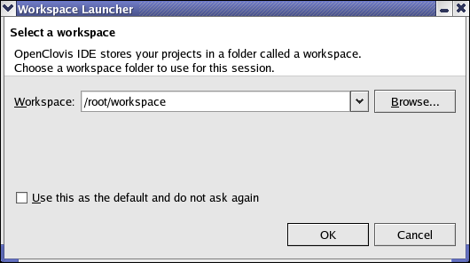
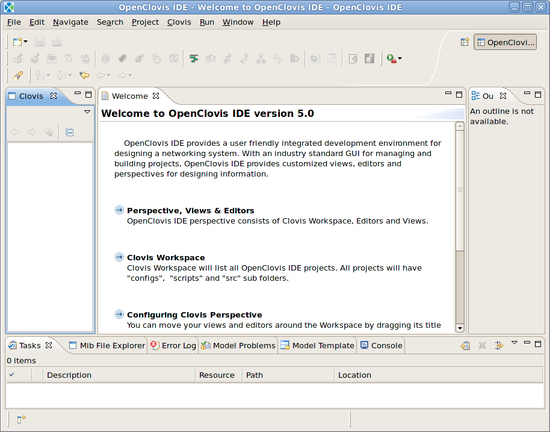
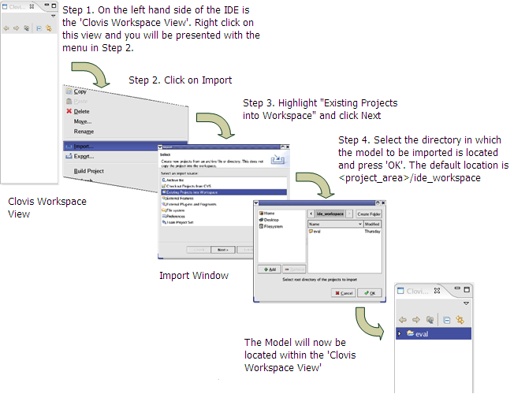
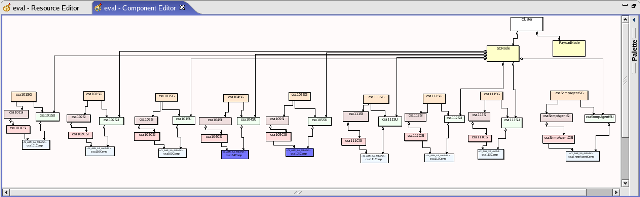
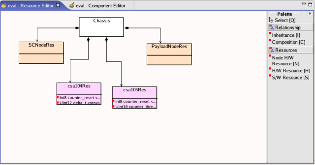
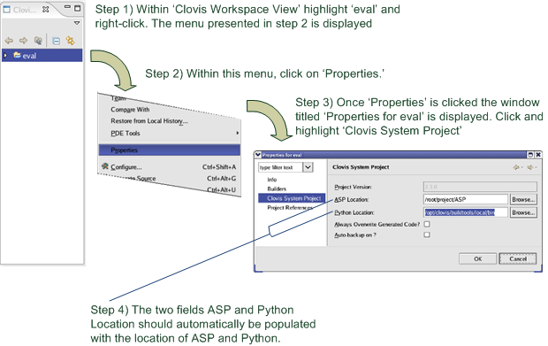

Examining The Evaluation Model
==============================
During your journey through the evaluation guide, it may be instructive to refer back to the "cluster model" to discover how the 
various applications in the different modules are configured. The "cluster model" consists of the definition of the nodes in the 
cluster, the processes each node runs, the grouping of these processes into redundancy (or "protection") groups, and the objects 
the cluster "presents" to the management station (the management model).

The cluster model is defined by XML files. Understanding and editing this XML by hand is very difficult and is much better 
accomplished through the OpenClovis SAFplus IDE.

The OpenClovis SAFplus IDE is an Eclipse-based Integrated Development Environment designed to simplify and accelerate the 
development of the cluster model. It provides a simple and powerful mechanism with easy drag-and-drop features, to create resources 
and components, define attributes and relationships between them. The OpenClovis IDE graphical interface enables you to capture the 
Information Models through UML notifications and save them as XML files.

Before proceeding, it is recommended that the reader work through the **OpenClovis Sample Application Tutorial**, which will introduce 
you to cluster modelling using the IDE. Further information about the IDE is available in the OpenClovis IDE User's Guide.

And to prevent the repetition of data we expect that you have installed SAFplus and we suggest looking at section **Evaluation Wizard 
- Single Node Setup** and **Manually Building the Target Images**.

This chapter describes how to import and examine the cluster model used within this evaluation guide, and then how to regenerate 
the XML configuration and source code in case you would like to experiment with modifying the evaluation guide cluster model.

Starting the IDE
----------------
If you chose to create symbolic links during installation, from the command line enter cl-ide to launch OpenClovis IDE. Otherwise, 
please enter <the complete path to your chosen installation location>/6.1/sdk/bin/cl-ide

The splash screen for OpenClovis IDE is displayed followed by the Workspace Launcher, as presented in Figure OpenClovis IDE 
Workspace Launcher.

Within the **Workspace** field the default location of the workspace of IDE is placed. This is the location where information concerning 
the IDE and models created is saved. This can be altered by pressing the **Browse** button. Select the workspace directory and click OK 
to launch OpenClovis IDE as illustrated in the Figure OpenClovis IDE Welcome Screen.

Importing the Evaluation Model
------------------------------
First, we need to import the model.

The Clovis Works model is now presented within the Clovis Workspace View. To, view the Resource Editor, right click on 
**eval** -> select **Clovis** -> select **Resource Editor**. For the Component Editor right click on **eval**-> select **Clovis** -> select 
**Component Editor**. The Resource and Component Editor views will now be presented. See Figures below.

This is the Evaluation Model used as the foundation of our Evaluation System. From here you have the opportunity to explore the 
model in its entirety. To understand how to navigate the IDE please refer to the OpenClovis IDE User Guide.

Generating Configuration and Source Code
----------------------------------------
If changes are made to the model configuration, it is necessary to regenerate the configuration XML and source code. During this 
regeneration, the system will attempt to merge changes made to the files with the newly generated source. Similar to the issues 
encountered in multi-branch development using revision control systems, it is difficult to automatically merge changes. Therefore, 
if code is regenerated it may be necessary handle merge issues by hand. One rule-of-thumb is that once the basic code is generated 
it is rarely necessary to overwrite it (the exception is if the cluster management object model -- i.e SNMP access is extended). 
Therefore, a common strategy is to regenerate but then revert all source code (including Makefiles), only keeping changes to the 
XML files.

To generate source code a number of steps are required. First the location of SAFplus Platform and Python needs to be correct.

* **SAFplus Platform Location**:

  This usually appears by default. This is the location where the SAFplus Platform source code is installed. The default location is usually
  
  <install_dir>/6.1/sdk/src/SAFplus Platform.

* **Python Location**:
  
  Again the location of Python 2.4.2 or above should appear by default. If this is not the case python can be located within
  
  <installation-directory>/6.1/buildtools/local/bin
  
  The default <installation-directory> is /opt/clovis for root installation and $HOME/clovis for non root users. This is determined 
  during the installation of the SDK.

Once we are certain the locations of SAFplus Platform and Python 2.4.1 are correct we can now generate the code.

#. Within the **Clovis Workspace View** highlight **eval**; and right click to present a menu.
#. Within the menu select **Generate Source**.
#. A **Project Validation** pop up window is displayed with the message:

   **eval model has errors/warnings. Do you want to continue?**

   Press **OK**

Once **OK** is pressed the XML and source code is generated and placed within

<project-area_dir>/eval

You will now be able to view this generated source code within

<project-area_dir>/eval/src

You have the opportunity to compare how we built upon the generated code to further develop the Clovis Sample Application found 
within Chapter **Sample Applications**.

Configuring & Building Generated Code, and Starting SAFplus Platform
--------------------------------------------------------------------
Once the code for the eval model is generated, the first choice you will have to make is decide which hardware setup to run the 
generated code. This information can be found within is discussed in full within Chapter **Runtime Hardware Setup**.

The next logical step is to configure and build this code. There are two methods of doing this, the first via the OpenClovis IDE, 
as covered within the **OpenClovis Sample Application Tutorial**.

The second method, as discussed earlier, is via the command line. As you already have this document open we suggest looking again 
at Chapter **Building the Evaluation System and Deploying Runtime Images**:

* **Modifying the Clovis Sample Applications**

  Provides instructions on modifying the generated code.

* **Building SAFplus Platform and the Evaluation System**

  Provides details on how to configure and build SAFplus Platform and the generated model. One small difference here is that when 
  we run <install_dir>/6.1/sdk/src/SAFplus/configure -with-model-name it should be run with the generated eval model. E.g.:

  .. code-block:: text

    $ <install_dir>/6.1/sdk/src/SAFplus/configure --with-asp-build --with-model-name=eval

* **Configuration file - target.conf**

  The Hardware Setup choice you made will be required here in setting up the target.conf file

* **Building Single/Distributed Target Image(s)**

  Lists commands required to build the target images.

* **Content of Target Images**

  Provides details of the content of the target images for both the singe and distributed setups.

* **Runtime Software Installation**

  Once the images have been created this section provides information on how these can be copied to the target. Once the images are 
  copied to their targets we now have to start/stop SAFplus Platform. This is discussed within Section **Starting and Stopping SAFplus Platform.**

Running the Sample Applications
-------------------------------
The sample applications can be run via the SAFplus Platform Console, as described in each chapter.

Summary and Next Steps
----------------------
This appendix provided you with specific steps to open the OpenClovis IDE, import and open the Evaluation Model and generate the 
source code.
