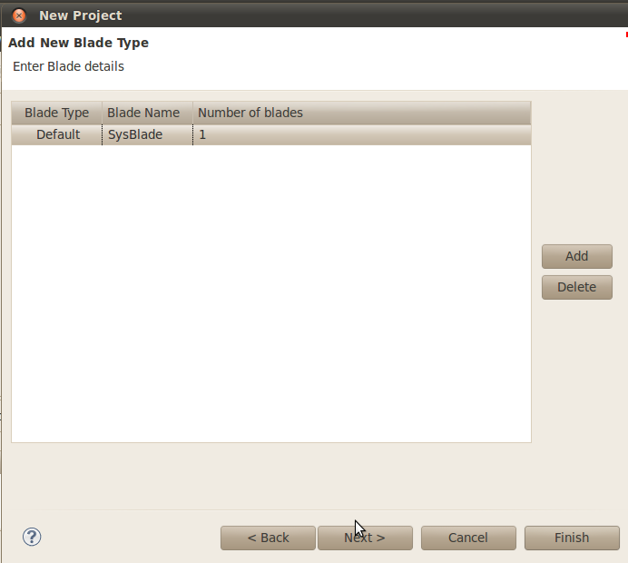
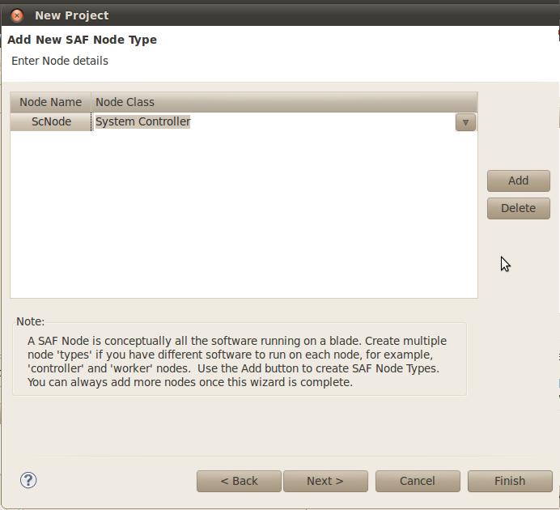
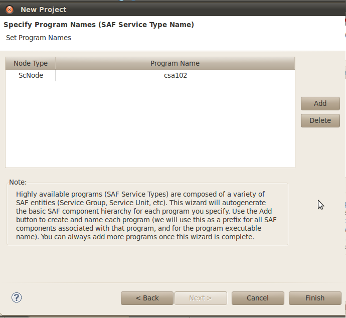
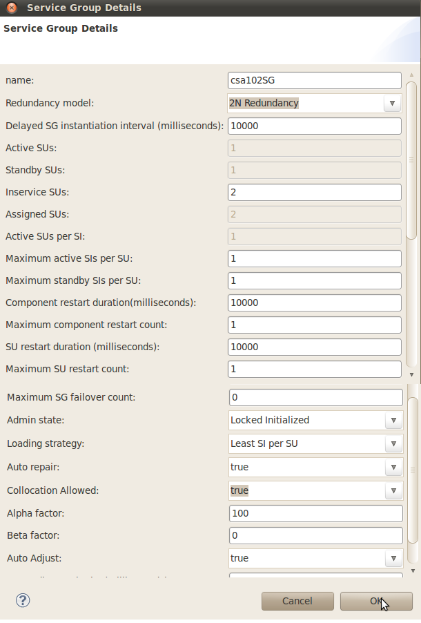
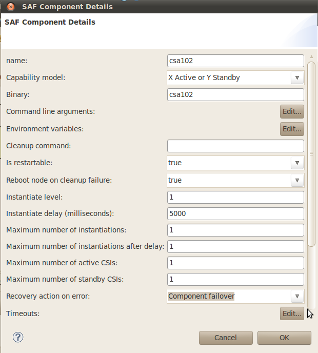
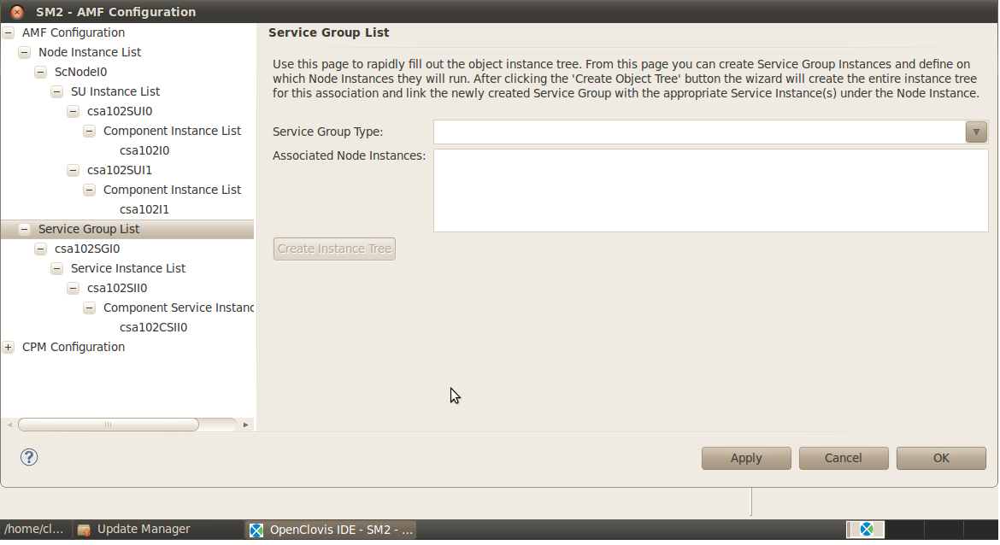

csa102 Redundancy and Failover
==============================

Objective
---------
This sample demonstrates basic HA (High Availability) and SU (Service Unit) fail-over functionality. The application has two components, 
both processing the same workload as csa101, that is, repeatedly printing "Hello World". The difference, however, is that in this 
case there is now an active component and a standby component, with only the active component performing the printing function.

csa102 is quite similar to csa101, and this section will discuss the areas in which they deviate.

What you will learn
-------------------
Keeping track of HA states and how to respond to callbacks requesting HA state changes.

How to create new Project Model csa102
--------------------------------------
The first step in setting up our example is to create a model which represents the system that we will eventually deploy. This is 
done through the **SAFplus Platform IDE**. In this chapter we will step through the following tasks:

* Create a project area
* Launch the **SAFplus Platform IDE**
* Create the IDE project
* Specify the Resource model for csa102(the types of physical hardware in our system)
* Specify the Component model (the types of components or applications in our system)
* Specify which Components run on which Resources
* Specify important build and boot parameters

Creating a New Project Area
---------------------------
A project area is a directory on your system where you can develop SAFplus Platform models and generate the code corresponding to 
those models. This is same as created for csa101.

Create a project area using a script from the command line. To create a project area named **projectarea1** in the **/home/clovis** 
directory you should execute the following command:

.. code-block:: text

    # cl-create-project-area /home/clovis/projectarea1

Launching the SAFplus Platform IDE
----------------------------------
You can launch the SAFplus Platform IDE from the command line. If you chose to create symbolic links during installation you can 
simply enter cl-ide from any directory. If you did not create symbolic links during installation you can either:

* Add the installation directory to the shells search path and then launch the IDE as follows:

.. code-block:: text

    # cl-ide

* Start cl-ide by specifying the full path

The splash screen for SAFplus Platform IDE is displayed as illustrated in Figure SAFplus Platform IDE Opening Screen.

.. image:: ../../../images/tutorial/Tutorial_GettingStartedIDE_OpeningScreen.png

You will then be prompted to select a workspace in which to do your work as illustrated in Figure SAFplus Platform IDE Workspace Launcher.

The workspace you select should correspond to the project area that you created in the previous section (in this case 
"/home/clovis/projectarea1"). Note that the workspace includes a subdirectory of "/ide_workspace". This is done strictly for 
organizational purposes. It keeps the IDE models separate from the generated SAFplus Platform models and code. Select the workspace a
nd click **OK** to launch SAFplus Platform IDE.

The **SAFplus Platform IDE** is launched and you are now looking at the main work area. For more information about the components of 
this main work area including the SAFplus Platform IDE menu and toolbar, see SAFplus Platform IDE User Guide.

Creating the Sample Project
---------------------------
We will now create a project within the **SAFplus Platform IDE**. This project will hold both the resource model and the component model 
**csa102** for our example system. The resource model is a physical view of the resources (the chassis, the blade types, etc.) in our 
system. The component model is a logical view of the components (applications, etc.) in our system.

We will be using the **New Project Wizard** to create our project. The wizard captures some high-level information about the system 
that we are building and performs a lot of the basic setup for us.

.. note::
    The same model that we are building through the wizard could also be created manually through the Resource and Component Editors. 
    For more information on the Resource and Component Editors see SAFplus Platform IDE User Guide.This step is similar compared to 
    csa101.

To launch the **New Project Wizard** select **File > New > Project** from the IDE menu bar.

The **New Project Wizard** is displayed and **Clovis System Project** is selected by default as illustrated in Figure New Project Wizard.

Click **Next**. The **Clovis System Project** window is displayed as illustrated in Figure Clovis System Project.

Enter the following information (These steps are similar compared to csa101):

* **Project Name**: Enter the name of your new project as **SampleModel**.

  Do not use spaces or special characters for the project name. The project name can be alphanumeric, but cannot start with a number 
  or have only numbers.

  Select **Use default** to use the same directory mentioned in the **Directory** field.

* **SDK Location**: Enter the location where the SAFplus Platform SDK was installed. For e.g. if the SDK was installed at location 
  /opt/clovis, then the SDK location is /opt/clovis/sdk-<version>.

* **Project Area Location**: Enter the location where the generated source code for the model should be stored.

  This can be any existing directory but is usually the project area that was created in the previous section.

* **Python Location**: Enter the location where Python 2.5.0 or above is installed on your system. If Python 2.5.0 or above was installed 
  by SAFplus Platform SDK, the directory is 

  .. code-block:: text

    <installation_directory>/6.1/buildtools/local/bin.

Click **Next**. The **Add New Blade Type** window is displayed. This dialog is used to define the blade types that are in our system.

Remember that the system we are modelling has only one blade type...a System Controller.

* Use the **Add** button to add a new blade type to the list. Name this blade type 'SysBlade' (for System Controller blade).

Click **Next**. The **Add New SAF Node Type** window is displayed. This dialog is used to define the type of logical node that will 
be run on the corresponding blade type defined in the previous dialog.

Node types represent groups of software. They are classified as either a System Controller class or a Payload class. This distinction 
gives the node type certain characteristics which cause it to behave in a well-defined manner. Since we have only a System Controller 
in our system we will add a node type of class System Controller.

* Use the **Add** button to add a new node type to the list. Name the node type 'SCNode' and ensure that its node class is 'System Controller 
  (SAF Class B)'.

Click **Next**. The **Specify Program Names** window is displayed. This dialog is used to create programs or SAF Service Types and associate 
them with the SAF Node Types specified in the previous dialog.

In our system we need one SAF Service Type which represents our high availability software (csa102 continuously prints "Hello World!" 
**redundantly**).

* Use the **Add** button to add a program name to the list. Change the program name to 'csa102' and associate the program with the 'SCNode' 
  node type.

Click **Finish**. This will create the sample model using the blade type, node type, and program name information collected through the 
'New Project Wizard' dialogs.

Configuring the Service Group
-----------------------------
To make changes to the Service Group double-click on the box titled **csa102SG**. The **Service Group Details** dialog is displayed.

* The first change we want to make is to the **Redundancy Model**. The **Redundancy Model** is the strategy that is used by the SAFplus 
  Platform system to recover from a node failure. For our redundant model (which only has one node with one Active component and 
  another standby component used for redundancy) change the **Redundancy Model** to '2N Redundancy' as shown.
  
  .. note::
    You will notice that when you change the redundancy model some of the other fields are modified automatically and become read-only. 
    This is to ensure integrity of the redundancy models.

* The second change that we want to make is to the **Admin State**. The **Admin State** defines the state of the component when the 
  system is first brought up. In our case we want to change the **Admin State** to be 'Locked Initialized'. This means that when 
  the system first starts up this **Service Group** (and its subcomponents) will be initialized but not yet put into a running state. 
  So our csa102 application will not yet start printing "Hello World!".

* The third change that we want to make is to the **Auto repair**. The **Auto repair** defines the state of the component to be 
  achieved after failure of the component. So our csa102 application will not yet start printing "Hello World!".

* When you are finished making the changes click the **OK** button to commit the changes.

Configuring the SAF Component
-----------------------------
To make changes to the SAF Component double-click on the box titled **csa102**. The **SAF Component Details** dialog is displayed.

To make the model to recover from failure by Stand-by component, the field **Recovery action on error** needs to be changed to **Component 
fail over**.

The SAF Component represents our high availabilty program or executable. We need to pass a command line argument to this executable. 
The reason for this argument is to force the program to print the 'Hello World!' output to a special log file for our viewing. We 
will look at this more closely when we customize our code.

Configuring Physical Instances
------------------------------
The configuration of our logical models is complete. During this process we have defined all of the 'types' of objects in our 
system. Now it is time to configure actual instances of those objects so that they can be built and deployed.

Object instance configuration is done through the Availability Management Framework (AMF) via the **AMF Configuration** dialog.

* To launch this dialog go to the the **Clovis** menu and select **AMF Configuration**...

The **AMF Configuration** window will be displayed. If you now completely expand the AMF Configuration branch of the tree in the left-hand 
pane you will see the following.

Code
----
The code can be geneteted using the same steps as mentioned for csa101. The genetated code can be found within the following directory

.. code-block:: text

    <project-area_dir>/eval/src/app/csa102Comp

This sample component is implemented in a few C modules that are quite similar to the csa101 module. We will discuss the additions in detail.

We change the logging from the default "application" stream to a custom stream. To do this, we include the header that defines our config routines, 
change the default "clLogApp" macro to use a different stream, and define that stream as a global variable:

.. code-block:: c
    :caption: main.c

    #include "../ev/ev.h"
    ...
    #define clprintf(severity, ...)   clAppLog(gEvalLogStream, severity, 10, CL_LOG_AREA_UNSPECIFIED, CL_LOG_CONTEXT_UNSPECIFIED, __VA_ARGS__)
    ...
    ClLogStreamHandleT  gEvalLogStream = CL_HANDLE_INVALID_VALUE;

Next, the log stream is initialized in the application's "main" function:

.. code-block:: c
    :caption: main.c

    /*
        * Initialize the log stream
        */
    clEvalAppLogStreamOpen((ClCharT*)appName.value, &gEvalLogStream);

This function is implemented in the src/app/ev.c file.

As with csa102, the safAssignWork() function is called to set the component's HA state, and the following block of code assigns 
this requested state to the component, while verbosely detailing this process:

.. code-block:: c
    :caption: main.c

    void safAssignWork(SaInvocationT       invocation,
                            const SaNameT       *compName,
                            SaAmfHAStateT       haState,
                            SaAmfCSIDescriptorT csiDescriptor)
    {
        /*
        * Print information about the CSI Set
        */

        clprintf (CL_LOG_SEV_INFO, "Component [%.*s] : PID [%d]. CSI Set Received\n", 
                compName->length, compName->value, mypid);

        printCSI(csiDescriptor, haState);

        /*
        * Take appropriate action based on state
        */

        switch ( haState )
        {
            case SA_AMF_HA_ACTIVE:
            {
                /*
                * AMF has requested application to take the active HA state 
                * for the CSI.
                */
                pthread_t thr;
                
                clprintf(CL_LOG_SEV_INFO,"csa102: ACTIVE state requested; activating service");
                running = 1;
                pthread_create(&thr,NULL,activeLoop,NULL);
                
                saAmfResponse(amfHandle, invocation, SA_AIS_OK);
                break;
            }

            case SA_AMF_HA_STANDBY:
            {
                /*
                * AMF has requested application to take the standby HA state 
                * for this CSI.
                */
                clprintf(CL_LOG_SEV_INFO,"csa102: Standby state requested");
                running = 0;
                saAmfResponse(amfHandle, invocation, SA_AIS_OK);
                break;
            }

            case SA_AMF_HA_QUIESCED:
            {
                /*
                * AMF has requested application to quiesce the CSI currently
                * assigned the active or quiescing HA state. The application 
                * must stop work associated with the CSI immediately.
                */
                clprintf(CL_LOG_SEV_INFO,"csa102: Acknowledging new state quiesced");
                running = 0;

                saAmfResponse(amfHandle, invocation, SA_AIS_OK);
                break;
            }

            case SA_AMF_HA_QUIESCING:
            {
                /*
                * AMF has requested application to quiesce the CSI currently
                * assigned the active HA state. The application must stop work
                * associated with the CSI gracefully and not accept any new
                * workloads while the work is being terminated.
                */
                clprintf(CL_LOG_SEV_INFO,"csa102: Signaling completion of QUIESCING");
                running = 0;

                saAmfCSIQuiescingComplete(amfHandle, invocation, SA_AIS_OK);
                break;
            }
    ...

In this case the application spawns a thread when it is assigned active which is a very common strategy for threaded applications. 
It also sets a global variable "running" to true. When the application is "quesced" -- that is when the active work assignment is 
taken away -- the application sets this global variable back to 0 to trigger the active thread to quit itself. The thread is simply 
defined as:

.. code-block:: c
    :caption: main.c

    void* activeLoop(void* p)
    {
        while (running)
        {
            clprintf(CL_LOG_SEV_INFO,"csa102: Threaded Hello World! %s", show_progress());
            sleep(2);
        }
        return NULL;
    }

    static char* show_progress(void)
    {
        static char bar[] = "          .";
        static int progress = 0;

        /* Show a little progress bar */
        return &bar[sizeof(bar)-2-(progress++)%(sizeof(bar)-2)];
    }

The example also demonstrates a non-threaded approach. But first, some background: for both threaded and non-threaded applications, 
the main must have a "dispatch" loop that handles incoming AMF notifications and calls the relevant callback. So to implement a 
single threaded SAF aware application, the programmer must modify this dispatch loop adding active (and potentially standby) 
functionality:

.. code-block:: c
    :caption: main.c

    main(...)

        do
        {
            struct timeval timeout;
            timeout.tv_sec = 2; timeout.tv_usec = 0;

            FD_ZERO(&read_fds);
            FD_SET(dispatch_fd, &read_fds);

            if( select(dispatch_fd + 1, &read_fds, NULL, NULL, &timeout) < 0)
            {
                if (EINTR == errno)
                {
                    continue;
                }
                clprintf (CL_LOG_SEV_ERROR, "Error in select()");
                perror("");
                break;
            }
            if (FD_ISSET(dispatch_fd,&read_fds)) saAmfDispatch(amfHandle, SA_DISPATCH_ALL);
            
            if (running) clprintf(CL_LOG_SEV_INFO,"csa102: Unthreaded Hello World! %s", show_progress());  // Run the "active" code
            else clprintf(CL_LOG_SEV_INFO,"csa102: idle");
        }while(!unblockNow); 

This code should be very familiar to anyone who has written single threaded "event loop" style code. As can be seen in the code 
snippet above, the select is given an idle timeout (in a real application the timeout would be much smaller) and the application 
only calls saAmfDispatch if the select actually indicates that the there is data in the FD. Then it falls down into an "if" 
statement that checks if we are active "if (running)..." and outputs a log if that is the case.

How to Run csa102 and What to Observe
-------------------------------------
As with the csa102 example we will use the SAFplus Platform Console to manipulate the administrative state of the csa102 service group.

Start the SAFplus Platform Console
^^^^^^^^^^^^^^^^^^^^^^^^^^^^^^^^^^

.. code-block:: text

    # cd /root/asp/bin
    # ./asp_console

Lock assignment csa102SGI0
^^^^^^^^^^^^^^^^^^^^^^^^^^
put the csa102SGI0 service group into lock assignment state using the following commands:

.. code-block:: text

    cli[Test]-> setc 1
    cli[Test:SCNodeI0]-> setc cpm
    cli[Test:SCNodeI0:CPM]-> amsLockAssignment sg csa102SGI0

Because example 102 has two components there will be two application log files to view. These are:

* /root/asp/var/log/csa102I0Log.latest
* /root/asp/var/log/csa102I1Log.latest.

Viewing these application logs using the tail -f, you should see the following:

.. code-block:: text
    :caption: /root/asp/var/log/csa102I0Log.latest

    Fri Nov 14 16:54:40.339 2014 (SCNodeI0.22012 : csa102I0.MAI.---.00001 :   INFO) 
        Component [csa102I0] : PID [22012]. Initializing

    Fri Nov 14 16:54:40.340 2014 (SCNodeI0.22012 : csa102I0.MAI.---.00002 :   INFO)    
        IOC Address             : 0x1

    Fri Nov 14 16:54:40.340 2014 (SCNodeI0.22012 : csa102I0.MAI.---.00003 :   INFO)    
        IOC Port                : 0x81

    Fri Nov 14 16:54:42.342 2014 (SCNodeI0.22012 : csa102I0.MAI.---.00004 :   INFO) 
        csa102: idle

.. code-block:: text
    :caption: /root/asp/var/log/csa102I1Log.latest

    Fri Nov 14 16:54:40.347 2014 (SCNodeI0.22013 : csa102I1.MAI.---.00001 :   INFO) 
        Component [csa102I1] : PID [22013]. Initializing

    Fri Nov 14 16:54:40.347 2014 (SCNodeI0.22013 : csa102I1.MAI.---.00002 :   INFO)    
        IOC Address             : 0x1

    Fri Nov 14 16:54:40.347 2014 (SCNodeI0.22013 : csa102I1.MAI.---.00003 :   INFO)    
        IOC Port                : 0x82

    Fri Nov 14 16:54:42.350 2014 (SCNodeI0.22013 : csa102I1.MAI.---.00004 :   INFO) 
        csa102: idle

Unlock csa102SGI0
^^^^^^^^^^^^^^^^^
Next, unlock the service group using the following SAFplus Platform Console command:

.. code-block:: text

    cli[Test:SCNodeI0:CPM]-> amsUnlock sg csa102SGI0

and in the /var/log/csa102I*.log files we should see:

.. code-block:: text
    :caption: /root/asp/var/log/csa102I0Log.latest

    Fri Nov 14 16:55:21.816 2014 (SCNodeI0.22012 : csa102I0.MAI.---.00024 :   INFO) 
        Component [csa102I0] : PID [22012]. CSI Set Received

    Fri Nov 14 16:55:21.816 2014 (SCNodeI0.22012 : csa102I0.MAI.---.00025 :   INFO) 
        CSI Flags : [Add One]

    Fri Nov 14 16:55:21.816 2014 (SCNodeI0.22012 : csa102I0.MAI.---.00026 :   INFO) 
        CSI Name : [csa102CSII0]

    Fri Nov 14 16:55:21.816 2014 (SCNodeI0.22012 : csa102I0.MAI.---.00027 :   INFO) 
        Name value pairs :

    Fri Nov 14 16:55:21.816 2014 (SCNodeI0.22012 : csa102I0.MAI.---.00028 :   INFO) 
        HA state : [Active]
    Fri Nov 14 16:55:21.816 2014 (SCNodeI0.22012 : csa102I0.MAI.---.00029 :   INFO) 
        Active Descriptor :
    Fri Nov 14 16:55:21.816 2014 (SCNodeI0.22012 : csa102I0.MAI.---.00030 :   INFO) 
        Transition Descriptor : [1]

    Fri Nov 14 16:55:21.816 2014 (SCNodeI0.22012 : csa102I0.MAI.---.00031 :   INFO) 
        Active Component : [csa102I0]

    Fri Nov 14 16:55:21.816 2014 (SCNodeI0.22012 : csa102I0.MAI.---.00032 :   INFO) 
        csa102: ACTIVE state requested; activating service

    Fri Nov 14 16:55:21.818 2014 (SCNodeI0.22012 : csa102I0.MAI.---.00033 :   INFO) 
        csa102: Unthreaded Hello World! .

    Fri Nov 14 16:55:21.818 2014 (SCNodeI0.22012 : csa102I0.MAI.---.00034 :   INFO) 
        csa102: Threaded Hello World!  .

    Fri Nov 14 16:55:23.818 2014 (SCNodeI0.22012 : csa102I0.MAI.---.00035 :   INFO) 
        csa102: Threaded Hello World!   .

    Fri Nov 14 16:55:23.821 2014 (SCNodeI0.22012 : csa102I0.MAI.---.00036 :   INFO) 
        csa102: Unthreaded Hello World!    .

    Fri Nov 14 16:55:25.819 2014 (SCNodeI0.22012 : csa102I0.MAI.---.00037 :   INFO) 
        csa102: Threaded Hello World!     .

    Fri Nov 14 16:55:25.823 2014 (SCNodeI0.22012 : csa102I0.MAI.---.00038 :   INFO) 
        csa102: Unthreaded Hello World!      .

.. code-block:: text
    :caption: /root/asp/var/log/csa102I1Log.latest

    Fri Nov 14 16:55:21.855 2014 (SCNodeI0.22013 : csa102I1.MAI.---.00024 :   INFO) 
        Component [csa102I1] : PID [22013]. CSI Set Received

    Fri Nov 14 16:55:21.855 2014 (SCNodeI0.22013 : csa102I1.MAI.---.00025 :   INFO) 
        CSI Flags : [Add One]

    Fri Nov 14 16:55:21.855 2014 (SCNodeI0.22013 : csa102I1.MAI.---.00026 :   INFO) 
        CSI Name : [csa102CSII0]

    Fri Nov 14 16:55:21.855 2014 (SCNodeI0.22013 : csa102I1.MAI.---.00027 :   INFO) Name value pairs :

    Fri Nov 14 16:55:21.855 2014 (SCNodeI0.22013 : csa102I1.MAI.---.00028 :   INFO) 
        HA state : [Standby]

    Fri Nov 14 16:55:21.855 2014 (SCNodeI0.22013 : csa102I1.MAI.---.00029 :   INFO) 
        Standby Descriptor :

    Fri Nov 14 16:55:21.855 2014 (SCNodeI0.22013 : csa102I1.MAI.---.00030 :   INFO) 
        Standby Rank : [1]

    Fri Nov 14 16:55:21.855 2014 (SCNodeI0.22013 : csa102I1.MAI.---.00031 :   INFO) 
        Active Component : [csa102I0]

    Fri Nov 14 16:55:21.855 2014 (SCNodeI0.22013 : csa102I1.MAI.---.00032 :   INFO) 
        csa102: Standby state requested

    Fri Nov 14 16:55:21.855 2014 (SCNodeI0.22013 : csa102I1.MAI.---.00033 :   INFO) 
        csa102: idle

These can be watched in a separate terminal window using tail -f. csa102I0 is the active component in this case, and csa102I1 is 
the standby. Consequently, the "Hello world!" lines appear in csa102I0.log and not in csa102I1.log. They will continue to be logged 
to that file until the HA state of that component changes, for example, when the process logging those lines is killed. In the mean 
time the standby component: csa102I1 just waits until it is told that it should take over the workload.

Changing the HA state of the Client/Server
^^^^^^^^^^^^^^^^^^^^^^^^^^^^^^^^^^^^^^^^^^
The easiest way to test component fail-over is to kill the process associated with the active component using the kill command. For 
this you need to know the process ID of the active component. To find the process ID issue the following command from a bash shell.

.. code-block:: text

    # ps -eaf | grep csa102

This should produce an output that looks similar to the following:

.. code-block:: text

    root     22012 21797  0 16:54 ?        00:00:00 /root/asp/bin/csa102 -p
    root     22013 21797  0 16:54 ?        00:00:00 /root/asp/bin/csa102 -p
    root     22089  2321  0 16:55 pts/0    00:00:00 grep --color=auto csa102

Notice the two entries that end with csa102 -p. These are our two component processes. The first one is usually the active process. 
This is the one that we will kill. In this case the process ID is 22012. So to kill the active component you issue the command:

.. code-block:: text

    # kill -9 22012

.. note::
    If this step does not result in the active component being killed then it is likely that the standby component was killed. In 
    this case simply try killing the other process.

After executing the kill command you can see in the csa102I1 application that the standby component is now active.

.. code-block:: text
    :caption: /root/asp/var/log/csa102I1Log.latest

    Fri Nov 14 16:56:00.257 2014 (SCNodeI0.22013 : csa102I1.MAI.---.00053 :   INFO) 
        Component [csa102I1] : PID [22013]. CSI Set Received

    Fri Nov 14 16:56:00.257 2014 (SCNodeI0.22013 : csa102I1.MAI.---.00054 :   INFO) 
        CSI Flags : [Target All]

    Fri Nov 14 16:56:00.257 2014 (SCNodeI0.22013 : csa102I1.MAI.---.00055 :   INFO) 
        HA state : [Active]

    Fri Nov 14 16:56:00.257 2014 (SCNodeI0.22013 : csa102I1.MAI.---.00056 :   INFO) 
        Active Descriptor :

    Fri Nov 14 16:56:00.257 2014 (SCNodeI0.22013 : csa102I1.MAI.---.00057 :   INFO) 
        Transition Descriptor : [3]

    Fri Nov 14 16:56:00.257 2014 (SCNodeI0.22013 : csa102I1.MAI.---.00058 :   INFO) 
        Active Component : [csa102I0]

    Fri Nov 14 16:56:00.257 2014 (SCNodeI0.22013 : csa102I1.MAI.---.00059 :   INFO) 
        csa102: ACTIVE state requested; activating service

    Fri Nov 14 16:56:00.257 2014 (SCNodeI0.22013 : csa102I1.MAI.---.00060 :   INFO) 
        csa102: Unthreaded Hello World! .

    Fri Nov 14 16:56:00.257 2014 (SCNodeI0.22013 : csa102I1.MAI.---.00061 :   INFO) 
        csa102: Threaded Hello World!  .

    Fri Nov 14 16:56:02.258 2014 (SCNodeI0.22013 : csa102I1.MAI.---.00062 :   INFO) 
        csa102: Threaded Hello World!   .

    Fri Nov 14 16:56:02.259 2014 (SCNodeI0.22013 : csa102I1.MAI.---.00063 :   INFO) 
        csa102: Unthreaded Hello World!    .

    Fri Nov 14 16:56:04.259 2014 (SCNodeI0.22013 : csa102I1.MAI.---.00064 :   INFO) 
        csa102: Threaded Hello World!     .

    Fri Nov 14 16:56:04.261 2014 (SCNodeI0.22013 : csa102I1.MAI.---.00065 :   INFO) 
        csa102: Unthreaded Hello World!  

This indicates that the standby component has taken over for the failed active component.

Looking in the csa102I0 application log you can see that this component was killed and has been restarted. Since csa102I1 took over 
as the active component this component now goes into the standby state.

.. code-block:: text
    :caption: /root/asp/var/log/csa102I0Log.latest

    Fri Nov 14 16:56:00.768 2014 (SCNodeI0.22096 : csa102I0.MAI.---.00001 :   INFO) 
        Component [csa102I0] : PID [22096]. Initializing

    Fri Nov 14 16:56:00.768 2014 (SCNodeI0.22096 : csa102I0.MAI.---.00002 :   INFO)    
        IOC Address             : 0x1

    Fri Nov 14 16:56:00.768 2014 (SCNodeI0.22096 : csa102I0.MAI.---.00003 :   INFO)    
        IOC Port                : 0x83

    Fri Nov 14 16:56:00.769 2014 (SCNodeI0.22096 : csa102I0.MAI.---.00004 :   INFO) 
        Component [csa102I0] : PID [22096]. CSI Set Received

    Fri Nov 14 16:56:00.769 2014 (SCNodeI0.22096 : csa102I0.MAI.---.00005 :   INFO) 
        CSI Flags : [Add One]

    Fri Nov 14 16:56:00.769 2014 (SCNodeI0.22096 : csa102I0.MAI.---.00006 :   INFO) 
        CSI Name : [csa102CSII0]

    Fri Nov 14 16:56:00.769 2014 (SCNodeI0.22096 : csa102I0.MAI.---.00007 :   INFO) 
        Name value pairs :

    Fri Nov 14 16:56:00.769 2014 (SCNodeI0.22096 : csa102I0.MAI.---.00008 :   INFO) 
        HA state : [Standby]

    Fri Nov 14 16:56:00.769 2014 (SCNodeI0.22096 : csa102I0.MAI.---.00009 :   INFO) 
        Standby Descriptor :

    Fri Nov 14 16:56:00.769 2014 (SCNodeI0.22096 : csa102I0.MAI.---.00010 :   INFO) 
        Standby Rank : [1]

    Fri Nov 14 16:56:00.769 2014 (SCNodeI0.22096 : csa102I0.MAI.---.00011 :   INFO) 
        Active Component : [csa102I1]

    Fri Nov 14 16:56:00.769 2014 (SCNodeI0.22096 : csa102I0.MAI.---.00012 :   INFO) 
        csa102: Standby state requested

    Fri Nov 14 16:56:00.772 2014 (SCNodeI0.22096 : csa102I0.MAI.---.00013 :   INFO) 
        csa102: idle

You can continue to observe this failover by alternately killing the active component.

To stop csa102 using the SAFplus Platform Console.

.. code-block:: text

    cli[Test:SCNodeI0:CPM] -> amsLockAssignment sg csa102SGI0

Successfully changed state of csa102SGI0 to LockAssignment

.. code-block:: text

    cli[Test:SCNodeI0:CPM] -> amsLockInstantiation sg csa102SGI0
    cli[Test:SCNodeI0:CPM] -> end
    cli[Test:SCNodeI0] -> end
    cli[Test] -> bye

Successfully changed state of csa102SGI0 to LockInstantiation and exit.

Summary
-------
This Sample Application has covered basic HA and failover, with changing the state of a component to active and standby.
