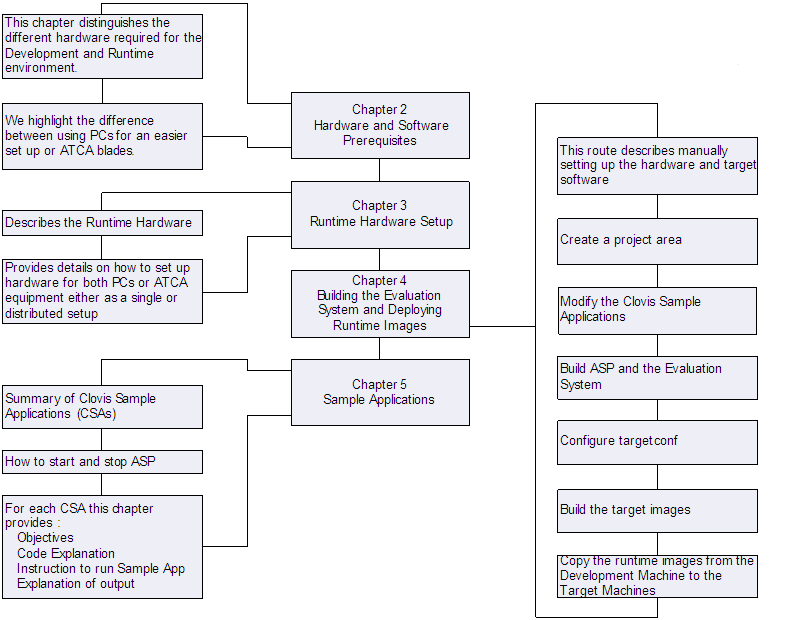

Objectives and Scope
====================

Objectives
----------
The Clovis Evaluation System's objective is to provide an evaluation software package that can be used to learn more about OpenClovis 
SAFplus Platform SDK. By the end of the evaluation the user will gain a better understanding of:

* The scope of the product. The sample applications are not a comprehensive tour of all OpenClovis SAFplus Platform features but do 
  cover the ones most commonly used.
* The usage patterns associated with the product
* The product's quality and usability

Scope
-----
To help users gain a better understanding of our product this Evaluation System User Guide introduces the SAFplus Platform runtime 
sample applications. To cover these areas of interest this document encompasses the following:

* **Chapter 2**: Covers the necessary HW & SW required
* **Chapter 3**: Presents the Hardware Setups possible with PC(s)/Laptop(s) or ATCA equipment.
* **Chapter 4**: Covers the steps to configure the software for the runtime environments on which to run the sample applications and 
  provides steps to install the target images from the Development Machine.
* **Chapter 5**: Provides instructions on running the SAFplus Platform and the sample applications. For each sample application a 
  description is provided that explains its purpose, highlights key blocks of code, shows how to run it on the cluster, and 
  describes what to observe.

