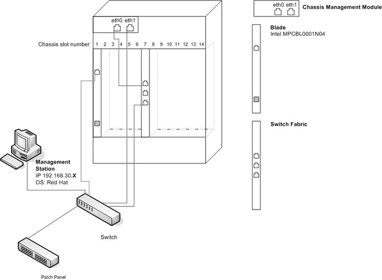
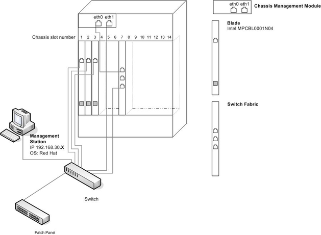
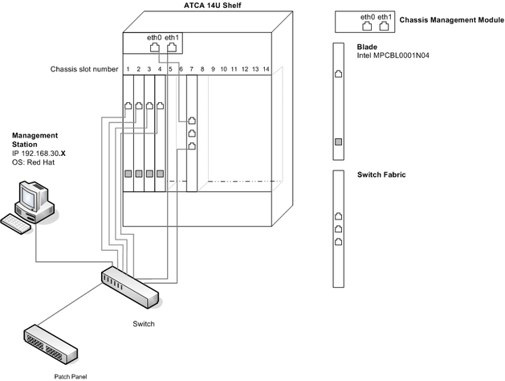
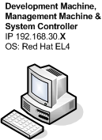
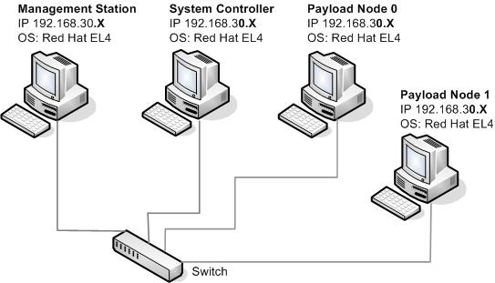
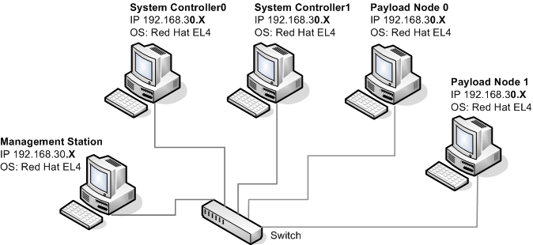

Runtime Hardware Setup
======================
As SAFplus Platform will run on an environment which consists of chassis, blades, switch fabrics and shelf managers, we have created 
Runtime Hardware Setup 1.1, 1.2 and 1.3. If this equipment is not available we suggest using a similar environment where 
PCs/laptops/Virtual Machines can be used to replace the chassis and blades, see Runtime Hardware setup 2.1, 2.2 and 2.3.

**Management Station Machine**

The Management Machine allows users to launch the Evaluation System on the target environment, enabling them to remotely control 
SAFplus Platform (via ssh), start and stop sample applications and monitor output.

**System Controller**

One or more System Controllers are required within our target environment. For further information on the role of a System 
Controller see the Clovis SAFplus Platform User Guide.

**Payload Node**

Two Payload Nodes are required for our Evaluation System to demonstrate multi node SAFplus Platform functionality. This is 
required for Runtime Setup 1.2, 1.3, 2.2 and 2.3.

Runtime Hardware Setup 1.1
--------------------------
This is the simple chassis, blade setup. Where one blade/node is present and acts as the System controller. Within the Runtime 
Hardware Setup 1.1, the following equipment is used.

* 1 ATCA Chassis
* 1 x Intel MPCBL0001N04 Blades.
* 1 ATCA Chassis Management Module (CMM)
* 1 ATCA Switch Fabric
* 1 PC Management Station

+-------------------+-------------------+--------------------+
|                   | System Controller | Management Station |
+===================+===================+====================+
|   OS              | Linux             | Linux              |
+-------------------+-------------------+--------------------+
|   Kernel V        | 2.6 and above     | 2.6 and above      |
+-------------------+-------------------+--------------------+
|   eth0            | 192.168.30.X      | 192.168.0.X        |
+-------------------+-------------------+--------------------+
|   Chassis Slot    | 1                 |                    |
+-------------------+-------------------+--------------------+

.. raw:: html

   

.. rst-class:: center

**Runtime Hardware Setup 1.1**

.. note::
    The IP addresses here are examples. The end user is able to use his/her IP address. The necessary changes have to be made to 
    target.conf. (See Section Configuration File - target.conf)

The following diagram shows how the above equipment has been interconnected.

Runtime Hardware Setup 1.2
--------------------------
This is the chassis and blade setup, where three blades/nodes are present that act as the System Controller and two Payload Nodes. 
Within the Runtime Hardware Setup 1.2, the following equipment is used:

* 1 ATCA Chassis
* 3 x Intel MPCBL0001N04 Blades.
* 1 ATCA Chassis Management Module
* 1 ATCA Switch Fabric
* 1 PC Management Station

+--------------+-------------------+---------------+---------------+--------------------+
|              | System Controller | Payload Node0 | Payload Node1 | Management Station |
+==============+===================+===============+===============+====================+
|   OS         | Linux             | Linux         | Linux         | Linux              |
+--------------+-------------------+---------------+---------------+--------------------+
|   Kernel V   | 2.6 and above     | 2.6 and above | 2.6 and above | 2.6 and above      |
+--------------+-------------------+---------------+---------------+--------------------+
|   eth0       | 192.168.30.X      | 192.168.30.X  | 192.168.30.X  | 192.168.30.X       |
+--------------+-------------------+---------------+---------------+--------------------+
| Chassis Slot | 1                 | 2             | 3             |                    |
+--------------+-------------------+---------------+---------------+--------------------+

.. rst-class:: center

**Runtime Hardware Setup 1.2**

Runtime Hardware Setup 1.3
--------------------------
This four blade setup, requires two System Controllers and two Payload Nodes. The following equipment is used:

* 1 ATCA Chassis
* 4 x Intel MPCBL0001N04 Blades.
* 1 ATCA Chassis Management Module
* 1 ATCA Switch Fabric
* 1 PC Management Station

+--------------+-------------------+-------------------+---------------+---------------+--------------------+
|              | System Controller0| System Controller1| Payload Node0 | Payload Node1 | Management Station |
+==============+===================+===================+===============+===============+====================+
|   OS         | Linux             | Linux             | Linux         | Linux         | Linux              |
+--------------+-------------------+-------------------+---------------+---------------+--------------------+
|   Kernel V   | 2.6 and above     | 2.6 and above     | 2.6 and above | 2.6 and above | 2.6 and above      |
+--------------+-------------------+-------------------+---------------+---------------+--------------------+
|   eth0       | 192.168.30.X      | 192.168.30.X      | 192.168.30.X  | 192.168.30.X  | 192.168.30.X       |
+--------------+-------------------+-------------------+---------------+---------------+--------------------+
| Chassis Slot | 1                 | 2                 | 3             | 4             |                    |
+--------------+-------------------+-------------------+---------------+---------------+--------------------+

.. rst-class:: center

**Runtime Hardware Setup 1.3**

Runtime Hardware Setup 2.1
--------------------------
If chassis, blades and switch fabrics are not available and you wish to run the single node setup, then the target environment can 
be emulated by Runtime Hardware Setup 2.1. This is the simplest set up and requires only one PC/laptop/Virtual Machine to act as 
the Development Machine, Management Machine and System Controller.

+--------------+-------------------+
|              | System Controller |
+==============+===================+
|   OS         | Linux             |
+--------------+-------------------+
|   Kernel V   | 2.6 and above     |
+--------------+-------------------+
|   eth0       | 192.168.30.X      |
+--------------+-------------------+

.. rst-class:: center

**Runtime Hardware Setup 2.1**

Runtime Hardware Setup 2.2
--------------------------
If chassis, blades and switch fabrics are not available, then the target environment can be emulated by Runtime Hardware Setup 2.2. 
Below is a list of the required hardware:

* 4 PCs/Laptops/Virtual Machines
* 1 Management Station Machine
* 1 System Controller node
* 2 Payload Nodes (PCs/Laptops/Virtual Machines)
* 1 switch

+--------------+-------------------+---------------+---------------+--------------------+
|              | System Controller | Payload Node0 | Payload Node1 | Management Station |
+==============+===================+===============+===============+====================+
|   OS         | Linux             | Linux         | Linux         | Linux              |
+--------------+-------------------+---------------+---------------+--------------------+
|   Kernel V   | 2.6 and above     | 2.6 and above | 2.6 and above | 2.6 and above      |
+--------------+-------------------+---------------+---------------+--------------------+
|   eth0       | 192.168.30.X      | 192.168.30.X  | 192.168.30.X  | 192.168.30.X       |
+--------------+-------------------+---------------+---------------+--------------------+

.. rst-class:: center

**Runtime Hardware Setup 2.2**

Runtime Hardware Setup 2.3
--------------------------
If four PCs are available then the target environment can be emulated by Runtime Hardware Setup 2.3. Below is a list of the 
required hardware:

* 5 PCs/Laptops/Virtual Machines
* 1 Management Station Machine
* 2 System Controller node
* 2 Payload Nodes (PCs/Laptops/Virtual Machines)
* 1 switch

+--------------+-------------------+-------------------+---------------+---------------+--------------------+
|              | System Controller0| System Controller1| Payload Node0 | Payload Node1 | Management Station |
+==============+===================+===================+===============+===============+====================+
|   OS         | Linux             | Linux             | Linux         | Linux         | Linux              |
+--------------+-------------------+-------------------+---------------+---------------+--------------------+
|   Kernel V   | 2.6 and above     | 2.6 and above     | 2.6 and above | 2.6 and above | 2.6 and above      |
+--------------+-------------------+-------------------+---------------+---------------+--------------------+
|   eth0       | 192.168.30.X      | 192.168.30.X      | 192.168.30.X  | 192.168.30.X  | 192.168.30.X       |
+--------------+-------------------+-------------------+---------------+---------------+--------------------+

.. rst-class:: center

**Runtime Hardware Setup 2.3**

Summary and Next Steps
----------------------
This chapter has laid out the various hardware setups available to run our sample applications. Once you have chosen the set up 
that you wish to try and have all the hardware in place, correctly interlinked, the next step is to install the run time targets. 
This is discussed within the following chapter.
