SAFplus Platform Tutorial
=========================

Preface
-------
The SAFplus Platform Sample Application Tutorial is a comprehensive tutorial designed to highlight the steps involved in using 
SAFplus software to design and build a high availability system. In this tutorial you will learn to:

* Design a model using the SAFplus IDE
* Generate code from this model to provide middleware support
* Customize this code for a particular application
* Build and deploy the customized code
* Run the system to see the SAFplus Platform software in action

Audience
^^^^^^^^
SAFplus Platform Sample Application Tutorial is designed for system integrators, designers, and system architects. To use SAFplus 
Platform, you should be aware of the fundamentals of operation, management, and configuration of telecommunication and networking 
domains. You should also be familiar with C programming, UML notations, and have the basic knowledge of Linux.

This document assumes that you have installed the SAFplus Platform SDK, following the installation steps found in the SAFplus 
Platform Installation Guide.

Related Documents
^^^^^^^^^^^^^^^^^
For additional information about OpenClovis products, refer to the following guides:

* :ref:`SAFplus Platform Release Notes <rl-nt-label>` provides information about the software and the hardware required to install OpenClovis Application Service Platform (SAFplus Platform) and Integrated Development Environment (IDE). It summarizes the additional features and enhancements of the product since the previous release. It also summarizes the issues and limitations of the product and provides workarounds wherever applicable.
* **SAFplus Platform SA-Forum Compliance** describes the level of compliance of OpenClovis SAFplus Platform and its Application Programming Interface (API) with the relevant Service Availability Forum Specifications.
* **SAFplus Platform Installation Guide** provides the system requirements, installation procedure for OpenClovis SAFplus Platform, IDE, and the Evaluation System.
* **SAFplus Platform Sample Application Tutorial** explains the steps to create and build a sample model using OpenClovis IDE and OpenClovis SAFplus Platform. It also provides troubleshooting information for this process. This provides the logical first step in understanding the SAFplus Platform offering.
* **SAFplus Platform Evaluation System User Guide** provides all the required information to configure and run the sample models packaged within the Evaluation System. This document also provides good understanding of OpenClovis SAFplus Platform's functionality. This is the natural follow on to the OpenClovis Sample Application Tutorial as it builds on the example created in that document.
* **SAFplus Platform SDK User Guide** provides information about SAFplus Availability/Scalability Platform architecture, various SAFplus Platform components, and their interactions. This guide helps you to configure the OpenClovis SAFplus Platform components, compile, and execute the SAFplus Platform code to build your custom application.
* **SAFplus Platform IDE User Guide** describes the usage of Integrated Development Environment (IDE), a graphical development environment that complements the SAFplus Platform. This guide helps you to understand how to use the various features of the IDE to build the application.
* **SAFplus Platform Log Tool User Guide** provides information about the usage of OpenClovis Log Tool. OpenClovis Log Tool is an interactive utility that allows you to view binary log files in a readable format and hence monitor system errors, warnings, and other log information. Log Tool allows you to format the .log files and filter them to view the required entries.
* **SAFplus Platform API Reference Guide [1]** is provided for each component. It describes the Application Programming Interface (API), Service Model, and Management Information Model of the various OpenClovis Application Service Platform (SAFplus Platform) services. It helps the developer to understand the capabilities of the SAFplus Platform services and the APIs provided by these services.
* **SAFplus Platform Console Reference Guide** provides details about managing applications built on SAFplus Platform using the SAFplus Platform runtime debug console commands. SAFplus Platform Console commands can be used to manage, monitor, and test your application.

OpenClovis Online Technical Support
^^^^^^^^^^^^^^^^^^^^^^^^^^^^^^^^^^^
OpenClovis customers and partners can register on our Web site and receive personalized services and information. If you need any 
support or assistance while working on OpenClovis products, you can access the following: `openclovis.com <https://www.openclovis.com/>`__. 
Send your queries to: support@openclovis.com. Open source community support is available at: `openclovis.org/forum <http://www.openclovis.org/forum/>`__.

Documentation Feedback
^^^^^^^^^^^^^^^^^^^^^^
We are interested in hearing from our customers on the documentation provided with the product. Let us know your comments and 
suggestions on improving the documentation at OpenClovis Inc. Send your comments to: support@openclovis.com. Or even better, 
edit (or comment in) the page on our documentation wiki located at `help.openclovis.com <http://help.openclovis.com/>`__.

Our Example: The csa101 System
------------------------------
*The SAFplus Platform Sample Application Tutorial* will take you through a series of examples each introducing a key concept of the 
product. Each example builds on the example before it so it is important to go through them in order. The examples are named so 
that it is easy to determine their sequence. The examples all begin with the letters **csa** (standing for Clovis Sample Application) 
and end with a number. Our first example will be **csa101**.

The purpose of our first example is to highlight basic component management. It introduces the basic skeleton of a SAFplus Platform 
based application component and illustrates how it interacts with the System. It demonstrates basic component registration and 
life-cycle management.

We will keep this first example very simple. It will consist of the SAFplus Platform running a small component named **csa101**. All 
that this component will do is continuously print 'Hello World!' to a log file. While this component is not very exciting, it will 
allow us to easily see when the application is in a running state and when it is not. This will allow us to focus on the infrastructure 
of SAFplus Platform and how the application interfaces with it.

For this example we will assume that we have a chassis with five slots. We will have one type of blade in our example, a **System Controller**.

.. note::
    With the type of model we are developing we would typically define two blade types to install in these slots. The first blade 
    type would be a **System Controller** blade (which is responsible for running the SAFplus Platform software which manages application 
    startup, shutdown, failover, etc.) and the second blade type would be a **Payload** blade (which is responsible for running our 
    custom **csa101** application). However, for the purpose of simplifying the deployment of our system, we will define only the **System 
    Controller** blade type and have both the SAFplus Platform and component application run on this one blade. This will allow the 
    example to be run on a single PC.

Creating the csa101 Model
^^^^^^^^^^^^^^^^^^^^^^^^^
The first step in setting up our example is to create a model which represents the system that we will eventually deploy. This is 
done through the SAFplus Platform IDE. In this chapter we will step through the following tasks:

* Create a project area
* Launch the **SAFplus Platform IDE**
* Create the IDE project
* Specify the Resource model (the types of physical hardware in our system)
* Specify the Component model (the types of components or applications in our system)
* Specify which Components run on which Resources
* Specify important build and boot parameters

Launching the SAFplus Platform IDE
""""""""""""""""""""""""""""""""""
You can launch the SAFplus Platform IDE from the command line. If you chose to create symbolic links during installation you can 
simply enter cl-ide from any directory. If you did not create symbolic links during installation you can either:

* Add the installation directory to the shells search path and then launch the IDE. For example with a bash shell,

  .. code-block:: text

    # export PATH=$PATH:$install_dir/6.1/sdk/bin
    # cl-ide

* Or execute the command

  .. code-block:: text

    # <install_dir>/6.1/sdk/bin/cl-ide

The splash screen for SAFplus Platform IDE is displayed as illustrated in Figure SAFplus Platform IDE Opening Screen.

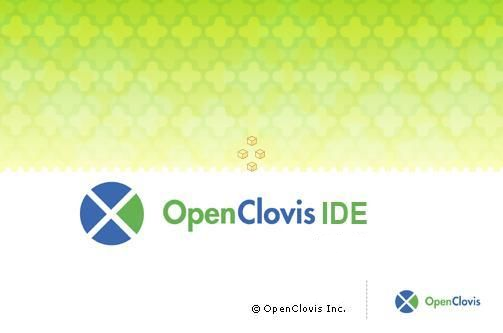

You will then be prompted to select a workspace in which to do your work as illustrated in Figure SAFplus Platform IDE Workspace Launcher.

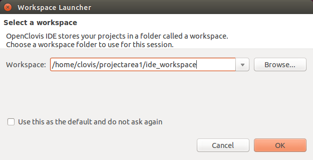

The workspace you select should correspond to the project area that you created in the previous section (in this case 
"/home/clovis/projectarea1"). Note that the workspace includes a subdirectory of "/ide_workspace". This is done strictly for 
organizational purposes. It keeps the IDE models separate from the generated SAFplus Platform models and code.

* Select the workspace and click OK to launch SAFplus Platform IDE as illustrated in the Figure SAFplus Platform IDE Welcome Screen.

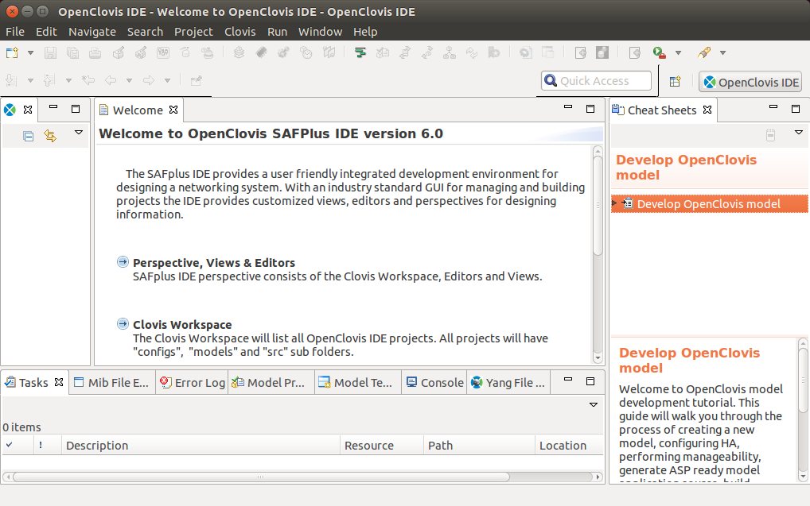

The SAFplus Platform IDE is launched and you are now looking at the main work area. For more information about the components of 
this main work area including the SAFplus Platform IDE menu and toolbar, see **SAFplus Platform IDE User Guide**.

Creating the Sample Project
"""""""""""""""""""""""""""
We will now create a project within the **SAFplus Platform IDE**. This project will hold both the resource model and the component 
model for our example system. The resource model is a physical view of the resources (the chassis, the blade types, etc.) in our 
system. The component model is a logical view of the components (applications, etc.) in our system.

We will be using the **New Project Wizard** to create our project. The wizard captures some high-level information about the system 
that we are building and performs a lot of the basic setup for us.

.. note::
    The same model that we are building through the wizard could also be created manually through the Resource and Component Editors. 
    For more information on the Resource and Component Editors see **SAFplus Platform IDE User Guide**.

To launch the **New Project Wizard** select **File > New > Project** from the IDE menu bar.

The **New Project Wizard** is displayed and **Clovis System Project** is selected by default as illustrated in Figure New Project Wizard.

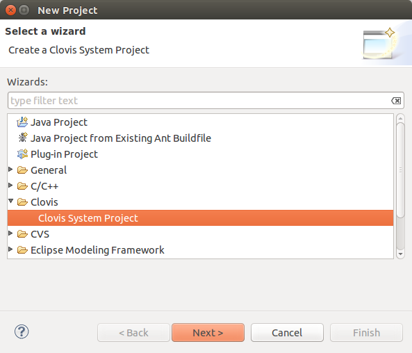

Click **Next**. The **Clovis System Project** window is displayed as illustrated in Figure Clovis System Project.

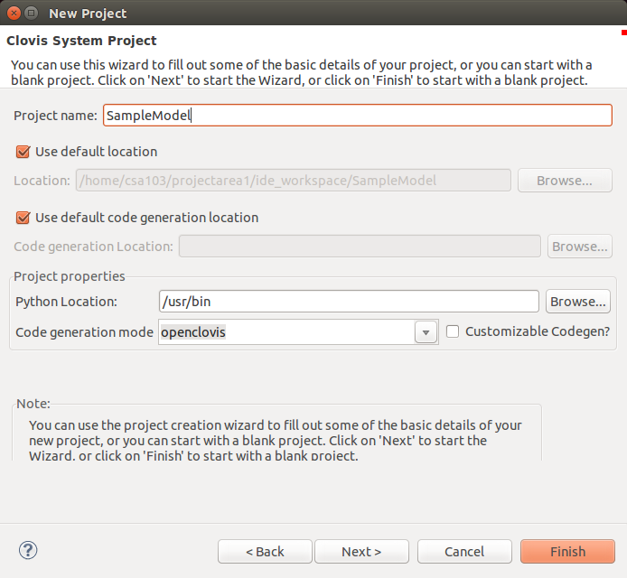

Enter the following information:

* **Project Name**: Enter the name of your new project as **SampleModel**.

  .. note::
    Do not use spaces or special characters for the project name. The project name can be alphanumeric, but cannot start with a 
    number or have only numbers.
    Select Use default to use the same directory mentioned in the Directory field.

* **Project Area Location**: Enter the location where the generated source code for the model should be stored.

  .. note::
    This can be any existing directory but is usually the project area that was created in the previous section.

* **Python Location**: Enter the location where Python 2.5.0 or above is installed on your system. If Python 2.5.0 or above was installed by SAFplus Platform SDK, the directory is:

  .. code-block:: text

    <installation_directory>/6.1/buildtools/local/bin.

Click **Next**. The **Add New Blade Type** window is displayed. This dialog is used to define the blade types that are in our system.

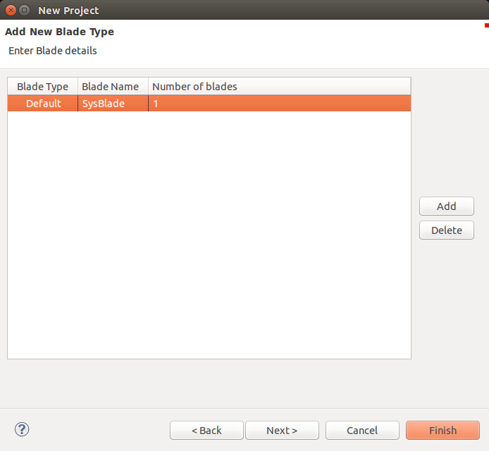

Remember that the system we are modelling has only one blade type...a System Controller.

* Use the **Add** button to add a new blade type to the list. Name this blade type 'SysBlade' (for System Controller blade).

Click **Next**. The **Add New SAF Node Type** window is displayed. This dialog is used to define the type of logical node that will 
be run on the corresponding blade type defined in the previous dialog.

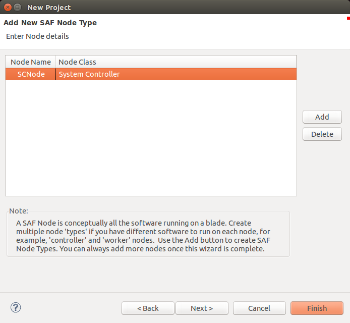

Node types represent groups of software. They are classified as either a System Controller class or a Payload class. This distinction 
gives the node type certain characteristics which cause it to behave in a well-defined manner. Since we have only a System Controller 
in our system we will add a node type of class System Controller.

* Use the **Add** button to add a new node type to the list. Name the node type 'SCNode' and ensure that its node class is 'System Controller 
  (SAF Class B)'.

Click **Next**. The **Specify Program Names** window is displayed. This dialog is used to create programs or SAF Service Types and associate 
them with the SAF Node Types specified in the previous dialog.

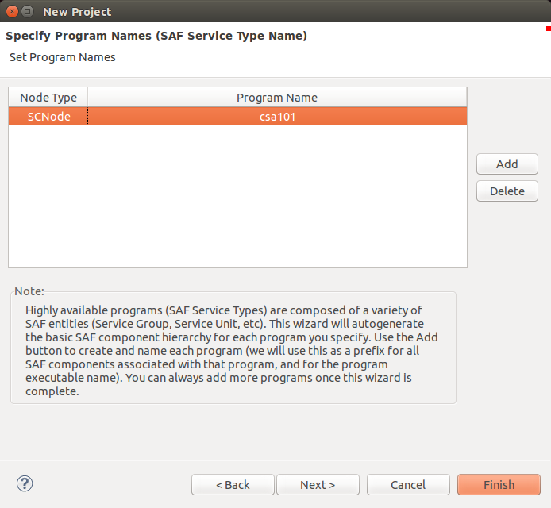

In our system we need one SAF Service Type which represents our high availability software (csa101 that continously prints 
"Hello World!").

* Use the **Add** button to add a program name to the list. Change the program name to 'csa101' and associate the program with the 'SCNode' 
  node type.

Click **Finish**. This will create the sample model using the blade type, node type, and program name information collected through the 
'New Project Wizard' dialogs.

Viewing the Model
"""""""""""""""""

The SAFplus Platform IDE Perspective
''''''''''''''''''''''''''''''''''''
Once the wizard pages are closed you will be returned to the main IDE view also known as the **SAFplus Platform IDE Perspective**. 
On the left hand side of this view you will see the **Clovis Workspace** pane which contains the new project you just created with 
all project related files and folders. The folders are displayed based on your filter settings. With the default filter settings, 
the folders shown in Figure Clovis Workspace is displayed in the **Clovis Workspace** pane. For information about filter settings, 
refer **SAFplus Platform IDE User Guide**.

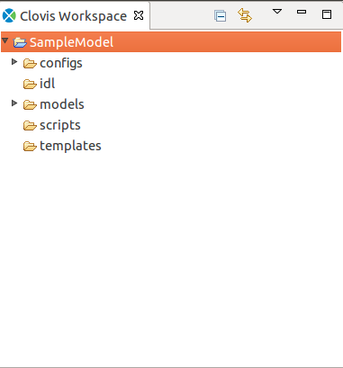

By default, the **Resource** and **Component** Editor views are available for the created project. To view them, click **Clovis** on the menu 
bar at the top of the screen and select **Resource Editor** or **Component Editor** from the menu. You can also click **Resource Editor** or 
**Component Editor** icons from the tool bar as shown in Figure SAFplus Platform IDE Tool Bar.

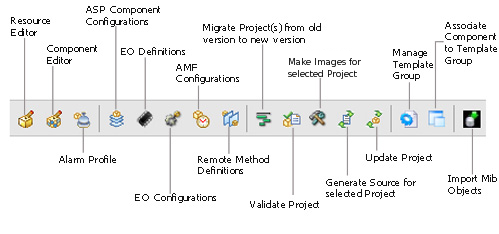

Resource Editor View
''''''''''''''''''''
The **Resource Editor** shows the types of physical objects in our system. It gives us a place to create new objects and interact with 
the objects that already exist. The **Resource Editor** view for our model should look similar to the following figure.

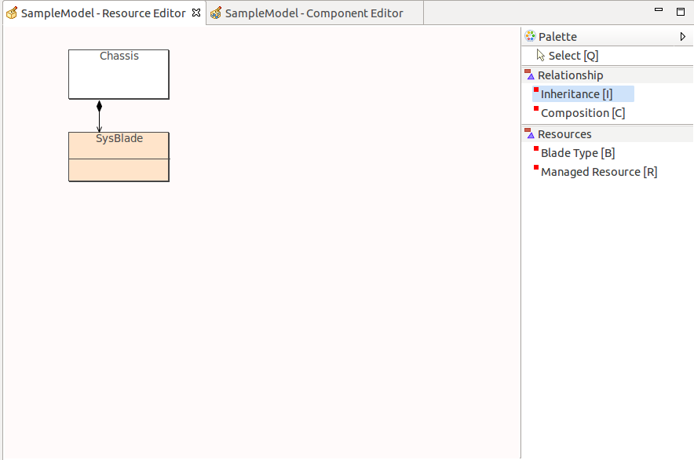

This editor always has a **Chassis** object which is the root of all other objects in the editor. In our case it also has the **SysBlade** 
blade type that we created through the **Project Creation Wizard**. You will also notice that the **SysBlade** is attached to the **Chassis** 
using a **Composition** relationship indicating that **SysBlades** reside within the **Chassis**.

On the right hand side of the editor view you will see the **Palette** which can be expanded and collapsed. Expanding the **Palette** you 
will see the list of objects that can be dragged onto the editor view to add to our model. Once an object is on the editor view you 
can view and change its properties by right clicking on the object and selecting **Properties...** from the context menu.

For more information about the **Resource Editor** view see SAFplus Platform IDE User Guide.

Component Editor View
'''''''''''''''''''''
The **Component Editor** shows the types of logical objects in our system. It gives us a place to create new objects and interact with 
the objects that already exist. The **Component Editor** view for our model should look similar to the following figure.

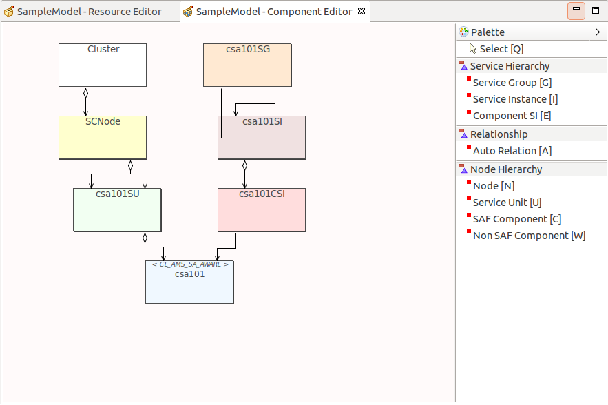

This editor always has a **Cluster** object which is the root of all other objects in the editor. In our case it also has the **SCNode** 
node type and the **csa101** SAF Service Type (a combination of Service Group, Service Unit, Service Instance, Component Service 
Instance, and SAF Component) that we created through the **Project Creation Wizard**. These have all been automatically attached in 
a way that makes a working model.

On the right hand side of the editor view you will see the **Palette** which can be expanded and collapsed. Expanding the **Palette** you 
will see the list of objects that can be dragged onto the editor view to add to our model. Once an object is on the editor view you 
can view and change its properties by right clicking on the object and selecting **Properties...** from the context menu.

For more information about the **Component Editor** view see SAFplus Platform IDE User Guide.

Configuring the Components
""""""""""""""""""""""""""
The **New Project Wizard** that we used to create our project configured the system using the most common options. We will have to make 
a few changes to this model in order for our example to work. We will make these changes in the **Component Editor** view.

In the Component Editor you will notice seven different objects that were created by the wizard. The first two of these are:

* Cluster: The root object of all other objects in the Component Editor view.
* SCNode: This is the SAF Node Type that we specified during project creation.

The next five objects all make up the Program or SAF Service Type that we specified on the last dialog of the New Project Wizard. 
These objects are:

* csa101SG: This is the Service Group representing our high availability software component.
* sa101SU: This is the Service Unit that is logically associated with the SCNode SAF Node Type.
* csa101SI: This is the Service Instance
* csa101CSI: This is the Component Service Instance
* csa101: This is the SAF Component which represents our program or executable.

We will be making changes to the Service Group (csa101SG), the Service Instance (csa101SI), and the SAF Component (csa101).

Configuring the Service Group
"""""""""""""""""""""""""""""
To make changes to the Service Group double-click on the box titled csa101SG. The Service Group Details dialog is displayed.

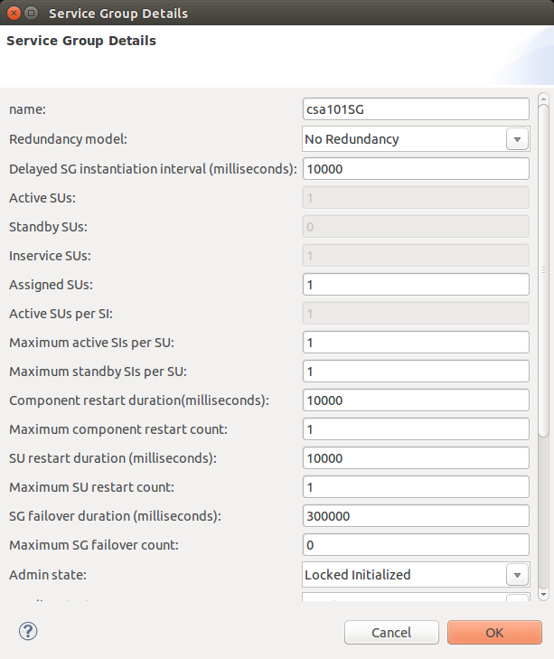

* The first change we want to make is to the **Redundancy Model**. The **Redundancy Model** is the strategy that is used by the SAFplus 
  Platform system to recover from a node failure. For our simple model (which only has one node) we are not going to rely on any 
  failover recovery so change the **Redundancy Model** to 'No Redundancy' as shown.

  .. note::
    You will notice that when you change the redundancy model some of the other fields are modified automatically 
    and become read-only. This is to ensure integrity of the redundancy models.

* The second change that we want to make is to the **Admin State**. The **Admin State** defines the state of the component when the system 
  is first brought up. In our case we want to change the **Admin State** to be 'Locked Initialized'. This means that when the system 
  first starts up this **Service Group** (and its subcomponents) will be initialized but not yet put into a running state. So our 
  csa101 application will not yet start printing "Hello World!".
* When you are finished making the changes click the **OK** button to commit the changes.

Configuring the Service Instance
""""""""""""""""""""""""""""""""
To make changes to the Service Instance double-click on the box titled **csa101SI**. The **Service Instance Details** dialog is displayed.

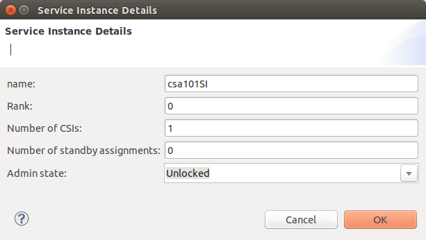

* The only change we want to make here is to the **Number of standby assignments**. This value represents the number of components that 
  will be waiting to take over during a node failure and goes hand-in-hand with the **Redundancy Model** that we selected for the 
  Service Group. Since we selected 'No Redundancy' for our **Redundancy Model** we need to set this value to 0...since we are not 
  supporting any failover in this model.
* When you are finished making the changes click the **OK** button to commit the changes.

Configuring the SAF Component
"""""""""""""""""""""""""""""
To make changes to the SAF Component double-click on the box titled **csa101**. The **SAF Component Details** dialog is displayed.

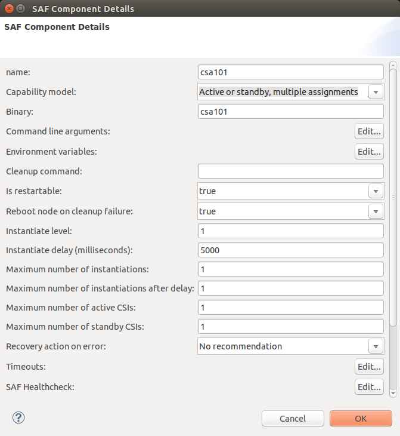

The SAF Component represents our high availabilty program or executable. We need to pass a command line argument to this executable. 
The reason for this argument is to force the program to print the 'Hello World!' output to a special log file for our viewing. 
We will look at this more closely when we customize our code.

* To add command line parameters click the **Edit...** button corresponding to the **Command line Arguments** label.

The **Command line Argument Details** dialog is displayed.

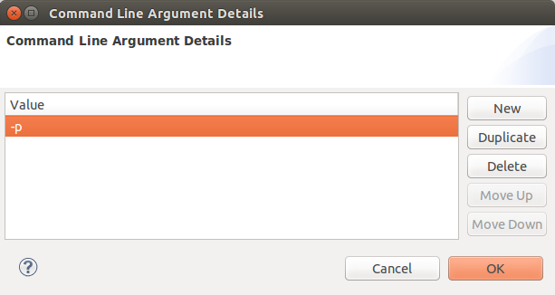

* Click the **New** button to add a new value to the list.
* Click on the new value in the list and it will become editable. Change the value to **-p**.
* Click the **OK** button to save and close the dialog.
* Click the **OK** button on the **SAF Component Details** dialog to commit the changes to the SAF Component and close the dialog.
* Save the component model using the **File > Save** menu item.

Configuring Physical Instances
""""""""""""""""""""""""""""""
The configuration of our logical models is complete. During this process we have defined all of the 'types' of objects in our system. 
Now it is time to configure actual instances of those objects so that they can be built and deployed.

Object instance configuration is done through the Availability Management Framework (AMF) via the **AMF Configuration** dialog.

* To launch this dialog go to the the **Clovis** menu and select **AMF Configuration...**

The **AMF Configuration** dialog is displayed.

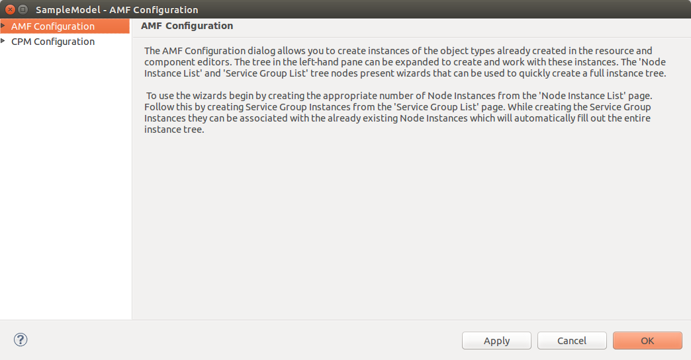

You will note from the instructions on this page that the physical instances representing the objects in our model can be created 
manually or by using wizards. Using the wizards will save us both typing and time so we will use these instead of creating each 
instance manually.

Creating Node Instances
"""""""""""""""""""""""
First we will create actual instances of the Node Types (in our case only one Node Type...SCNode) we created in our model.

* Double-click AMF Configuration in the left hand pane. The Node Instance List appears.
* Click on Node Instance List. The right hand pane displays the fields we must fill out to create our node instance.

In the right hand pane:

* Select SCNode for the **Node Type**.
* Select SysBlade for the **Blade type**.
* Enter 1 for the **Node Count**.

The complete form should look like the following.

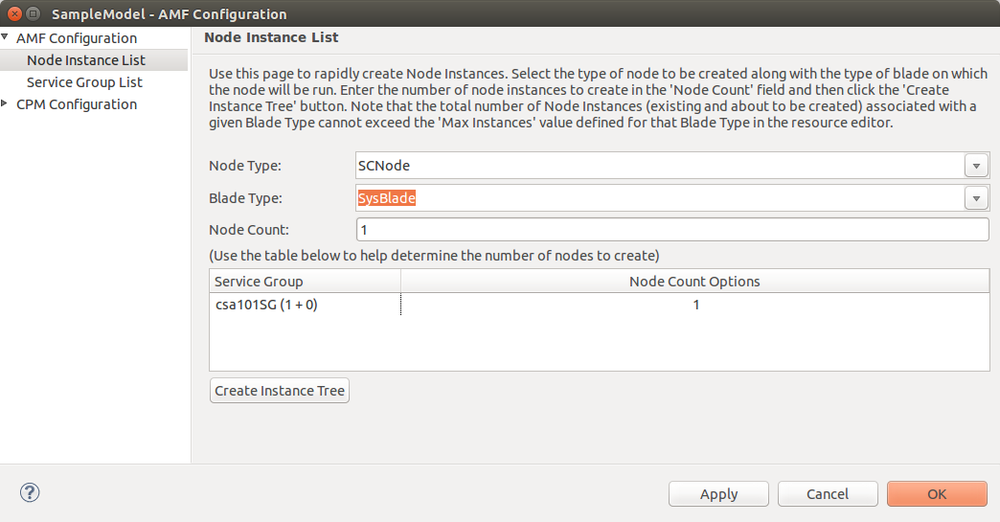

* Click the **Create Instance Tree** button to create our node instance.

Expanding the **Node Instance List** branch of the **AMF Configuration** tree in the left-hand pane reveals a new node instance named 
SCNodeI0 (indicating SCNode Instance 0).

Creating Service Group Instances
""""""""""""""""""""""""""""""""
Now we will create actual instances of the Service Groups that we defined in our model.

* Click on Service Group List. The right hand pane displays the fields we must fill out to create our service group instance.

In the right hand pane:

* Select csa101SG (the only service group type we defined) for the **Service Group Type**.

  * The **Associated Node Instances** list will be populated with all of the node instances that can be associated with the selected 
    service group type.

* Select SCNodeI0 from the **Associated Node Instances** list.

The completed form should look like the following.

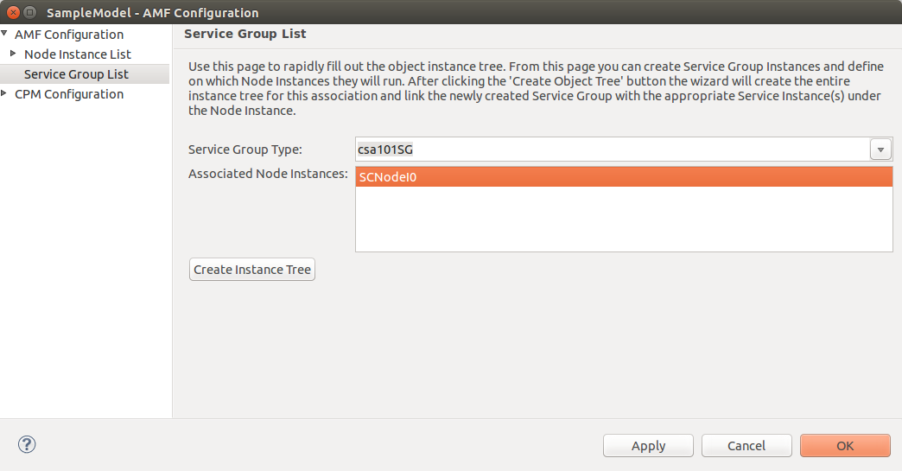

* Click the **Create Instance Tree** button to create our service group instance.

If you now completely expand the **AMF Configuration** branch of the tree in the left-hand pane you will see the following.

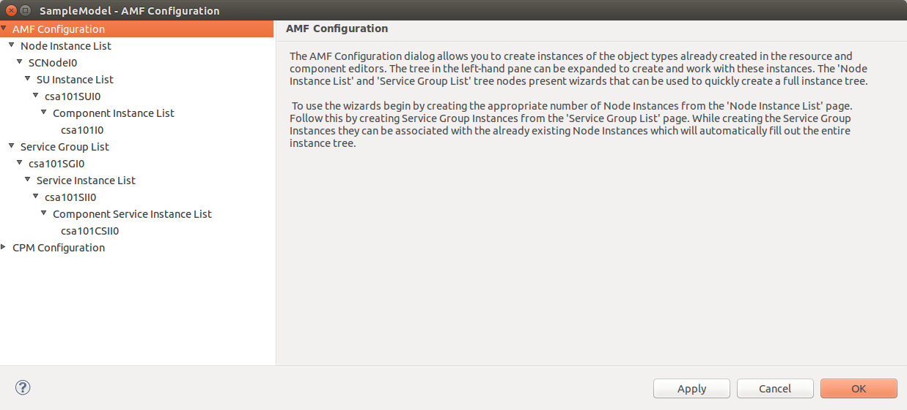

Notice that not only have the wizards created the node and service group instances for you, they have also filled out the entire 
instance tree. This was accomplished based on two key sets of information. The first of these is the association that was made 
between the service group type and the node instance in the **Service Group Wizard**. The second set of information is the component 
model that we created through the New Project Wizard and the Component Editor.

.. note::
    For more information regarding the specific properties of the generated instances see **Appendix B: AMF Configuration Instance** 
    Details.

Thats it. We are done modelling the csa101 example!

* Click the OK button to commit our changes and close the dialog.

Now its time to generate the framework code.

Generating the csa101 Code
^^^^^^^^^^^^^^^^^^^^^^^^^^
In this step we generate the source code for our example. The code that will be created is the framework code that handles all of 
the low level functionality provided by SAFplus Platform.

To generate the source code go to the **Project** menu and select **Generate Source**. Several progress dialogs will appear and after a few 
seconds code generation will be complete.

The source code and configuration XML files are generated and placed in subdirectories of the **Project Area Location** that we 
specified in the **New Project Wizard**. You can review this location by using the **Project > Properties** menu to get to the **Project 
Properties** dialog and then selecting **Clovis System Project** in the left hand pane.

You can review the generated code from within the SAFplus Platform IDE. To do this go to the **Clovis Workspace** pane and expand the 
**SampleModel** node. The node tree should look like the following.

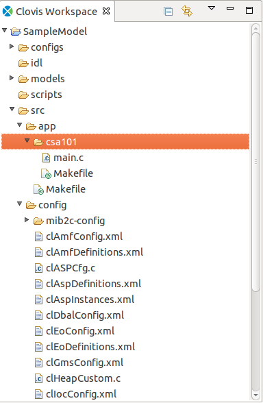

The code of particular interest to our example is in the SampleModel/src/app/csa101 branch of the tree. This is the code for our 
csa101 example. The csa101 example consist of one C module (main.c). There is also a make file that will be used for building the 
application. The main.c file implements our 'Hello World!' application.

.. note::
    If you run code generation a second time you will be presented with a dialog box asking if you would like to make a backup copy 
    of the existing source code before proceeding. You can answer No to this dialog.

Customizing the csa101 Code
^^^^^^^^^^^^^^^^^^^^^^^^^^^
While the code that was generated in the previous section can be built and run we want to make some changes to it so that we can 
easily see what our example is doing. For our example we will be changing one source file (main.c) and two make files.

.. note::
    In a real production situation this is the point where you would customize the code to perform the specific tasks of your product.

You will notice in the C file that there are several places where you see the following comment block.

.. code-block:: c
    :caption: main.c

    /*
        ---BEGIN_APPLICATION_CODE---
    */

    // ...

    /*
        ---END_APPLICATION_CODE---
    */
 
Makefiles have a similar convention but with a slightly different syntax.

.. code-block:: Makefile
    :caption: Makefile

    # ---BEGIN_APPLICATION_CODE---

    # ---END_APPLICATION_CODE---

These are sections of the file where it is safe to enter custom application code without having to worry about that code being 
overwritten if you were to again perform **Generate Source** for your model. This is important since the typical development cycle is 
an iterative process where you will return to the IDE to make modifications to your model.

To simplify the process of building and running the csa101 example, OpenClovis, Inc. has already made the necessary code customizations 
and shipped this code with the SAFplus Platform SDK. At this point you can simply replace the generated source files with these 
customized versions to avoid typing in the changes. We will go over each customization below and explain what was done.

To replace the generated files with the customized versions shipped with the SAFplus Platform SDK follow these instructions.

.. note::
    The sample applications containing the csa101 example can be found under the installation directory at 
    <install_dir>/6.1/sdk/src/examples/eval. For example, this directory is located at /opt/clovis/6.1/sdk/src/examples/eval for 
    "default" installations. We will refer to this directory in the remaining of this section as <eval_dir>.

    #. Exit the SAFplus Platform IDE using the File > Exit menu item. If you are prompted to save changes before exiting answer yes.
    #. Navigate to the source code work area.

        .. code-block:: text

            # cd /home/clovis/projectarea1/ide_workspace/SampleModel/src/app

    #. Using your favorite editor open the file Makefile that resides in this directory. This is the application make file.
    #. Add the following line to this file within the first BEGIN_APPLICATION_CODE and END_APPLICATION_CODE comment block. This will 
       instruct the build process to build our custom output library.

        .. code-block:: text

            SUBDIRS += ev

    #. Save this file and exit the editor.
    #. Execute the following command to copy the output package to our working area.

        .. code-block:: text

            # cp -r <eval_dir>/src/app/ev .

    #. Navigate to the component code work area.

        .. code-block:: text

            # cd csa101

    #. Execute the following command to copy the csa101 source code.

        .. code-block:: text

            # cp <eval_dir>/src/app/csa101Comp/main.c .

    #. Execute the following command to copy the component make file.

        .. code-block:: text

            # cp <eval_dir>/src/app/csa101Comp/Makefile .

    #. Restart the SAFplus Platform IDE.

        .. code-block:: text

            # cl-ide

Customizing main.c
""""""""""""""""""
The main.c file is the C module which will implement our 'Hello World!' behavior. We have to make changes in several parts of this file.

.. note::
    If you copied the files as instructed in the section above then these changes have already been made to the files. Use this 
    section to review and understand the changes.

In the include section of this file we have added a new include for ev.h. This refers to a special output library that we copied to 
our work area in the previous section. This output library is used to redirect output from the application to a component specific 
log. This is purely cosmetic but it will allow us to easily monitor what is happening when we run our example. Also, we change the 
logging from the default "application" stream to a custom stream. To do this, we include the header that defines our config routines, 
change the default "clLogApp" macro to use a different stream, and define that stream as a global variable:

.. code-block:: cpp
    :caption: main.c

    /*
        ---BEGIN_APPLICATION_CODE---
    */

    #include "../ev/ev.h"
    ...
    #define clprintf(severity, ...)   clAppLog(gEvalLogStream, severity, 10, "MAI", CL_LOG_CONTEXT_UNSPECIFIED,__VA_ARGS__)
    ...
    ClLogStreamHandleT  gEvalLogStream = CL_HANDLE_INVALID_VALUE;

    /*
        ---END_APPLICATION_CODE---
    */

Next we define a static variables that will keep track of the state of our application and a function to aid in showing when the 
application is running.

.. code-block:: cpp
    :caption: main.c

    /*
        ---BEGIN_APPLICATION_CODE---
    */

    static int running = 0;

    static char*
    show_progress(void)
    {
        static char bar[] = "          .";
        static int progress = 0;

        /* Show a little progress bar */
        return &bar[sizeof(bar)-2-(progress++)%(sizeof(bar)-2)];
    }

    /*
        ---END_APPLICATION_CODE---
    */

The running flag will be used to indicate whether the current application is active or suspended. The function show_progress returns 
a pointer to a c string with a number of spaces followed by a '.' character. The number of spaces in the string cycles from zero to 
an upper bound. This is used later on to provide visual indication of the progress of the application's output.

Next we have added a function activeLoop to print the output.

.. code-block:: cpp
    :caption: main.c

    void* activeLoop(void* p)
    {
        while (running)
        {
            clprintf(CL_LOG_SEV_INFO, "csa101: Threaded Hello World! %s\n",     
                    show_progress());
            sleep(2);
        }
        return NULL;
    }

Notice the while loop condition. This function uses the running variable that was initialized to 0, but set to 1 when the application 
was told to become active. The work of the application goes next: printing "Hello World!" along with the progress indicator. You 
could replace this with the application's real task. Finally, the command sleep(2) simply sleeps for two seconds so as not to fill 
log files too quickly.

When running becomes zero, we return from the function. This will happen when the application either quits or the AMF removes its 
"active" role.

Next, the log stream is initialized in the initializeAmf function.

.. code-block:: cpp
    :caption: main.c

    /*
    * ---BEGIN_APPLICATION_CODE---
    */

    /* Set up console redirection for demo purposes */
    clEvalAppLogStreamOpen((ClCharT *)appName.value, &gEvalLogStream);
    ...
    clprintf(CL_LOG_SEV_INFO,"csa101: Instantiated as component instance %s.", appName.value);
    clprintf(CL_LOG_SEV_INFO,"%s: Waiting for CSI assignment...", appName.value);

    /*
    * ---END_APPLICATION_CODE---
    */

Next we indicate log stream when we are exiting.

.. code-block:: cpp
    :caption: main.c

    /*
    * ---BEGIN_APPLICATION_CODE---
    */
    clEvalAppLogStreamClose(gEvalLogStream);
    /*
    * ---END_APPLICATION_CODE---
    */

This will cause activeLoop function to exit. Next we will put in code to manage the state of our application.

.. code-block:: cpp
    :caption: main.c

    void safAssignWork(SaInvocationT       invocation,
                    const SaNameT       *compName,
                    SaAmfHAStateT       haState,
                    SaAmfCSIDescriptorT csiDescriptor)
    {
        /*
        * ---BEGIN_APPLICATION_CODE--- 
        */

        // ...

        /*
        * ---END_APPLICATION_CODE---
        */

        /*
        * Print information about the CSI Set
        */

        clprintf (CL_LOG_SEV_INFO, "Component [%.*s] : PID [%d]. CSI Set Received\n",
                compName->length, compName->value, mypid);

        printCSI(csiDescriptor, haState);

        /*
        * Take appropriate action based on state
        */

        switch ( haState )
        {
            case SA_AMF_HA_ACTIVE:
            {
                /*
                * AMF has requested application to take the active HA state 
                * for the CSI.
                */

                /*
                * ---BEGIN_APPLICATION_CODE---
                */
                
                pthread_t thr;
                clprintf(CL_LOG_SEV_INFO, "csa101: ACTIVE state requested; activating service\n");
                running = 1;
                pthread_create(&thr,NULL,activeLoop,NULL);

                /*
                * ---END_APPLICATION_CODE---
                */

                saAmfResponse(amfHandle, invocation, SA_AIS_OK);
                break;
            }

            case SA_AMF_HA_STANDBY:
            {
                /*
                * AMF has requested application to take the standby HA state 
                * for this CSI.
                */

                /*
                * ---BEGIN_APPLICATION_CODE---
                */

                clprintf(CL_LOG_SEV_INFO,"csa101: Standby state requested");
                running = 0;

                /*
                * ---END_APPLICATION_CODE---
                */

                saAmfResponse(amfHandle, invocation, SA_AIS_OK);
                break;
            }

            case SA_AMF_HA_QUIESCED:
            {
                /*
                * AMF has requested application to quiesce the CSI currently
                * assigned the active or quiescing HA state. The application 
                * must stop work associated with the CSI immediately.
                */

                /*
                * ---BEGIN_APPLICATION_CODE---
                */
                clprintf(CL_LOG_SEV_INFO, "csa101: Acknowledging new state quiesced");
                running = 0;

                /*
                * ---END_APPLICATION_CODE---
                */

                saAmfResponse(amfHandle, invocation, SA_AIS_OK);
                break;
            }

            case SA_AMF_HA_QUIESCING:
            {
                /*
                * AMF has requested application to quiesce the CSI currently
                * assigned the active HA state. The application must stop work
                * associated with the CSI gracefully and not accept any new
                * workloads while the work is being terminated.
                */

                /*
                * ---BEGIN_APPLICATION_CODE---
                */
                clprintf(CL_LOG_SEV_INFO, "csa101: Signaling completion of QUIESCING");
                running = 0;

                /*
                * ---END_APPLICATION_CODE---
                */

                saAmfCSIQuiescingComplete(amfHandle, invocation, SA_AIS_OK);
                break;
            }

We have modified the safAssignWork callback function to let our application know what to do when the state changes. In the case 
where the state changes to SA_AMF_HA_ACTIVE we set the running variable to 1. This will cause our application to spawns a thread 
which calls activeLoop function and start printing the 'Hello World!' message. For any other state change we set the running 
variable to 0 which will cause the message to stop printing. For any state change we print out a message indicating the new state 
of the application.

The example also demonstrates a non-threaded approach. But first, some background: for both threaded and non-threaded applications, 
the main must have a "dispatch" loop that handles incoming AMF notifications and calls the relevant callback. So to implement a 
single threaded SAF aware application, the programmer must modify this dispatch loop adding active (and potentially standby) 
functionality:

.. code-block:: cpp
    :caption: main.c

    main(...)

        do
        {
            struct timeval timeout;
            timeout.tv_sec = 2; timeout.tv_usec = 0;

            FD_ZERO(&read_fds);
            FD_SET(dispatch_fd, &read_fds);

            if( select(dispatch_fd + 1, &read_fds, NULL, NULL, &timeout) < 0)
            {
                if (EINTR == errno)
                {
                    continue;
                }
                clprintf (CL_LOG_SEV_ERROR, "Error in select()");
                perror("");
                break;
            }
            if (FD_ISSET(dispatch_fd,&read_fds))
            {
                saAmfDispatch(amfHandle, SA_DISPATCH_ALL);
            }
            if (running) 
            {
                clprintf(CL_LOG_SEV_INFO,"csa101: Unthreaded Hello World! %s",
                        show_progress()); // Run the "active" code
            }
            else 
            {
                clprintf(CL_LOG_SEV_INFO,"csa101: idle");
            }
        }while(!unblockNow);

This code should be very familiar to anyone who has written single threaded "event loop" style code. As can be seen in the code 
snippet above, the select is given an idle timeout (in a real application the timeout would be much smaller) and the application 
only calls saAmfDispatch if the select actually indicates that the there is data in the FD. Then it falls down into an "if" 
statement that checks if we are active "if (running)..." and outputs a log if that is the case.

Customizing the Component MakeFile
""""""""""""""""""""""""""""""""""
We have to make a small change to the component MakeFile so that it knows about our special output library during the build. To do 
this we add the following lines. This file is located in /home/clovis/projectarea1/ide_workspace/SampleModel/src/app

.. code-block:: MakeFile
    :caption: Component MakeFile

        # ---BEGIN_APPLICATION_CODE---

        SUBDIRS += ev

        # ---END_APPLICATION_CODE---

Customizing the Application MakeFile
""""""""""""""""""""""""""""""""""""
We have to make sure that our special output library is built along with our application. To do this we change the line listing the 
sudirectories to make as follows. This file is located in the directory /home/clovis/projectarea1/ide_workspace/SampleModel/src/app/csa101.

.. code-block:: MakeFile
    :caption: Appilcation MakeFile

        # ---BEGIN_APPLICATION_CODE---

        ...

        EXTRA_LDLIBS += $(LIB_DIR)/libeval.a

        # ---END_APPLICATION_CODE---

We are finished customizing our application code!

Building the csa101 Code
^^^^^^^^^^^^^^^^^^^^^^^^
Now that we have finished customizing the code it is time to build it. The build process is launched using the **Project > Build Project** 
menu item. Once selected the **Build Configuration** dialog appears.

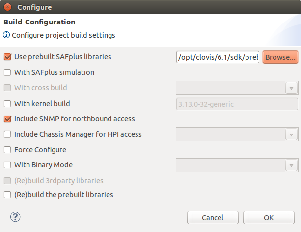

The **Build Configuration** dialog is used to gather specific information about the build we are about to perform. Using this dialog 
you can rebuild the same model using different cross builds, or including different chassis managers. We don't have to make any 
changes to this dialog since the default settings make sense for our sample application.

.. note::
    If you have prebuilt the SAFplus Platform libraries then you can check the Use pre built SAFplus checkbox and include the 
    location of the prebuilt libraries. For more information about pre-building SAFplus Platform libraries, see SAFplus Platform 
    SDK User Guide.

    The Include SNMP for North Bound Access control is checked by default. This just means that Net SNMP will be started along with 
    our system. If you want end-to-end connectivity you will need to supply an SNMP Sub Agent and a MIB. See the SAFplus Platform 
    SDK User Guide for more details.

    In the Project menu if the Build Project entry is not highlighted, then click in the right pane i.e. Clovis Workspace pane and 
    click the Project menu again. This not highlighting of the Build Project is because the Clovis Workspace is not selected properly 
    because of moving focus to some other pane.

Click the **OK** button to begin the build. If this is the first time that the project is being built, or if you have made changes to 
any setting on this screen, you will initially see a progress dialog indicating that the project is being configured. The 
configuration step is setting up the project for building. After the configuration has completed you will see a progress dialog 
indicating that the code is being built.

Creating the csa101 Images
^^^^^^^^^^^^^^^^^^^^^^^^^^
Making the csa101 images will create software packages that can be deployed on target machines to run the example. The process of 
creating images is launched using the **Project > Make Images** menu item. Once selected the **Make Images Configuration** dialog appears.

The **Make Images Configuration** dialog is used to indicate information about the environment on which the images will be deployed. 
This information is used to tailor the images to run on that environment. Here we will make the following modificaiton.

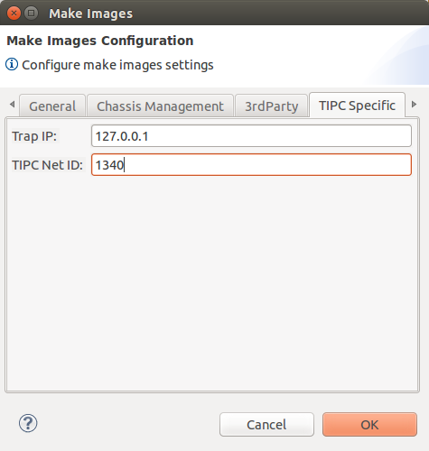

* Enter a value for the Trap IP. This value specifies where the SNMP sub-agent will send traps at runtime. This field is optional but 
  if specified must be a valid IP address. Enter a value of '127.0.0.1' in this field.

* Enter a value for the TIPC Net ID. This value represents a unique identifier used by TIPC to set up interprocess communication 
  across the deployed OpenClovis SAFplus Platform cluster. This field is required and should default to '1340'.

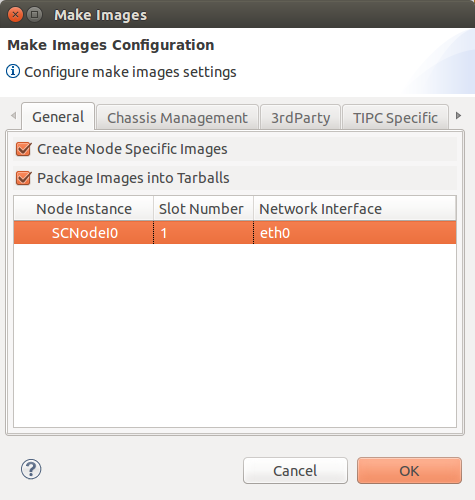

* Check the **Create Node Specific Images** and **Package Images** into Tarballs check boxes. This will create tarballs of the images making 
  them easy to deploy to various machines.
* The table on this dialog will hold a row for each node instance defined in the model. In our case this is only one...SCNodeI0. 
  For each of these instances we can define the slot number in the chassis on which the node will run and the network interface 
  that the node will use for communication. In our case enter '1' for the Slot Number and 'eth0' for the Network Interface.
* Click **OK** to begin the make image process. A dialog box will appear and after a few seconds the the make images process will be 
  complete.

The images will be populated at <project_area>/target/SampleModel/images. Each node-specific image is provided as a directory 
containing the run-time files (binaries, libraries, prerequisites, and configuration files) as well as a tarball with the same 
content. e.g. For our model containing one node (SCNodeI0) the following files and directories are generated for deployment on the 
run-time system.

.. code-block:: text

        <project_area>
        |+target
            |+<model>
                |+images
                    |+SCNodeI0
                    |   |+bin
                    |   |+etc
                    |   |+lib
                    |   |+modules
                    |   |+share
                    |-SCNodeI0.tgz

The rest of the steps in this example are all done from the command line so we can exit the IDE. To do this use the **File > Exit** 
menu item.

Deploying the csa101 Images
^^^^^^^^^^^^^^^^^^^^^^^^^^^
Now that the image has been built we must deploy it so that we can run and observe our example. Since we are assuming that the 
example will be run on the same machine as the images were built this is a fairly trivial exercise. Use the following steps to 
deploy the runtime image.

1. First we create a directory where we will install the image. In our case we will use /root/asp.

  .. code-block:: text

    # cd /root
    # mkdir asp

2. Next we navigate to that directory and untar the deployment package.

  .. code-block:: text

    # cd /root/asp
    # tar xzvf /home/clovis/projectarea1/target/SampleModel/images/SCNodeI0.tgz

The System Controller is now installed and ready to run.

.. note::
    If you were going to run the example on a machine other than the one where the images were built you would first copy the 
    installation tarball to that machine before performing the above steps.

Running the csa101 Example
^^^^^^^^^^^^^^^^^^^^^^^^^^
There are two parts to running the csa101 example. First we must start SAFplus Platform, and then we interact with the system components.

Starting SAFplus Platform
"""""""""""""""""""""""""
To start SAFplus Platform on System Controller node.

1. Open a shell.
2. Run the following commands

  .. code-block:: text

    # cd /root/asp
    # etc/init.d/asp start

.. note::
    This assumes that you are running the SAFplus Platform example on the same PC that you are executing these commands. If you are 
    running SAFplus Platform on a different machine then you should first ssh to that machine before executing the commands.

    If SAFplus Platform fails to start properly it could be due to the machine's firewall being enabled. SAFplus Platform will not 
    run on a machine which has firewall enabled. See the Environment Related Observation section of the SAFplus Platform Release 
    Notes for more information.

    By default the network interface used by the Group Membership Service is set to eth0. During the make images phase of the 
    tutorial we also set the ethernet interface for node SCNodeI0 to be eth0. During image generation these configuration parameters 
    are written to two files in the deployment package.

* /root/asp/etc/clGmsConfig.xml
* /root/asp/etc/asp.conf

There may be an occasion where you want to switch this interface for a machine on which you are deploying. If you would like to 
switch this interface on a machine without having to go through the process of rebuilding and redeploying, you can edit these two 
files and change the 'eth0' references to the interface you would like to use.

Interacting with the System Components
""""""""""""""""""""""""""""""""""""""
Once SAFplus Platform is up and running the next step is to start csa101 by informing SAFplus Platform that it should start the 
application. The Evaluation System's model tells SAFplus Platform that csa101 is locked for instantiation. This means that the 
process will not be started when SAFplus Platform comes up. This method of starting csa's is used for the Evaluation System, 
allowing users to interact with csa's and clearly see their output/functionality. Usually this would not be the case with 
applications, where they would run when SAFplus Platform begins.

At this point it would help to be familiar with the Service Availability Forum's notions of Service Unit, Service Group, and 
administrative state. The Service Availability Forum's Application Interface Specification (available from `saforum.org <https://www.associationvoice.com/Page/16627~217631/ErrorNotFoundhttpswwwassociationvoicecom443Service-Availability-Forum-E28093-Frequently-Asked-Questions-FAQ/>`__
and `opensaf.sourceforge.io <https://opensaf.sourceforge.io/>`__) 
is a good place to start.

In brief, the sample applications in the Evaluation System are part of service units which in turn are part of service groups. 
Service groups (and the service units that make up the service groups) can be in "administrative" states which include 
"LockInstantiation", "LockAssignment", and "Unlocked". There are other states, but these are the ones we care about for the 
purposes of this Evaluation System. If the administrative state of a service unit is "LockInstantiation" then the application that 
is part of that service unit will not even be started. If the administrative state is "LockAssignment" then the application will 
be started, but it will not be assigned any work. If the administrative state is "Unlocked" then it will not only be started, but 
will have a workload assigned to it, which is to say that it will start doing work (or start providing service), rather than idly 
sit waiting for work.

The administrative state of a service unit or service group can change from LockInstantiation to LockAssignment, from LockAssignment 
to Unlocked, or back to LockInstantiation, from Unlocked to LockAssignment. A picture might help here:

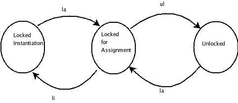

As the figure shows, the administrative state of a service unit (or service group) can change from "LockInstantiation" to 
"LockAssignment" and from there to "Unlocked", or back to "LockInstantiation". One way to change the administrative state of a 
service group is with the SAFplus Platform Console command line interface.

To use the SAFplus Platform Console:

#. Open a terminal on the Development Machine. (Or ssh into System Controller node as root, if you are running SAFplus Platform on 
   a machine other than the development machine.)
#. Change to image bin directory:

   .. code-block:: text

        # cd /root/asp/bin

#. Start the SAFplus Platform Console

   .. code-block:: text

        # ./asp_console

#. From within the SAFplus Platform Console:

   .. code-block:: text

        cli[Test]-> setc 1
        cli[Test:SCNodeI0]-> setc cpm
        cli[Test:SCNodeI0:CPM]-> amsLockAssignment sg csa101SGI0

   The above changes the administrative state of the group csa101SGI0 from "locked-for-instantiation" to "locked-for-assignment".

   .. note::
        For the command cli[Test]-> setc 1, the 1 represents the physical slot number of the System Controller within the Chassis. 
        Remember that we set our System Controller to be in slot 1 in the make images dialog.

#. Now lets tail the application log file so that we can see whats going on. In another window, as root, run:

   .. code-block:: text

        # tail -f /root/asp/var/log/csa101I0Log.latest

   You should see the following:

   .. code-block:: text
        :caption: /root/asp/var/log/csa101I0Log.latest

        Wed Nov 12 11:54:38.424 2014 (SCNodeI0.10950 : csa101I0.MAI.---.00001 :   INFO) 
            Component [csa101I0] : PID [10950]. Initializing

        Wed Nov 12 11:54:38.424 2014 (SCNodeI0.10950 : csa101I0.MAI.---.00002 :   INFO)    
            IOC Address             : 0x1

        Wed Nov 12 11:54:38.424 2014 (SCNodeI0.10950 : csa101I0.MAI.---.00003 :   INFO)    
            IOC Port                : 0x81

        Wed Nov 12 11:54:38.424 2014 (SCNodeI0.10950 : csa101I0.MAI.---.00004 :   INFO) 
            csa101: Instantiated as component instance csa101I0.

        Wed Nov 12 11:54:38.424 2014 (SCNodeI0.10950 : csa101I0.MAI.---.00005 :   INFO) 
            csa101I0: Waiting for CSI assignment...

#. Next change the administrative state of the csa101SGI0 service group to "unlocked" by running (in the SAFplus Platform Console):

   .. code-block:: text

        # cli[Test:SCNodeI0:CPM]-> amsUnlock sg csa101SGI0

   In the window where you're running the "tail -f" you should see:

   .. code-block:: text
        :caption: /root/asp/var/log/csa101I0Log.latest

        Wed Nov 12 11:59:37.092 2014 (SCNodeI0.10950 : csa101I0.MAI.---.00163 :   INFO) 
            csa101: ACTIVE state requested; activating service

        Wed Nov 12 11:59:37.092 2014 (SCNodeI0.10950 : csa101I0.MAI.---.00164 :   INFO) 
            csa101: Threaded Hello World!  .

        Wed Nov 12 11:59:39.094 2014 (SCNodeI0.10950 : csa101I0.MAI.---.00165 :   INFO) 
            csa101: Unthreaded Hello World!   .

        Wed Nov 12 11:59:39.095 2014 (SCNodeI0.10950 : csa101I0.MAI.---.00166 :   INFO) 
            csa101: Threaded Hello World!    .

        Wed Nov 12 11:59:41.095 2014 (SCNodeI0.10950 : csa101I0.MAI.---.00167 :   INFO) 
            csa101: Unthreaded Hello World!     .

        Wed Nov 12 11:59:41.097 2014 (SCNodeI0.10950 : csa101I0.MAI.---.00168 :   INFO) 
            csa101: Threaded Hello World!      .

        Wed Nov 12 11:59:43.095 2014 (SCNodeI0.10950 : csa101I0.MAI.---.00169 :   INFO) 
            csa101: Unthreaded Hello World!

   As you can tell from the output log our component is up and running! It is continuously printing our 'Hello World!' output.

#. Now change the state of the csa101SGI0 service group back to "locked-for-assignment" by running (in the SAFplus Platform Console):

   .. code-block:: text

        # cli[Test:SCNodeI0:CPM]-> amsLockAssignment sg csa101SGI0

   In the tail -f output you should see:

   .. code-block:: text
        :caption: /root/asp/var/log/csa101I0Log.latest

        Wed Nov 12 12:07:17.591 2014 (SCNodeI0.10950 : csa101I0.MAI.---.00625 :   INFO) 
            csa101: Unthreaded Hello World!  .

        Wed Nov 12 12:07:19.281 2014 (SCNodeI0.10950 : csa101I0.MAI.---.00626 :   INFO) 
            Component [csa101I0] : PID [10950]. CSI Set Received

        Wed Nov 12 12:07:19.281 2014 (SCNodeI0.10950 : csa101I0.MAI.---.00627 :   INFO) 
            CSI Flags : [Target One]

        Wed Nov 12 12:07:19.281 2014 (SCNodeI0.10950 : csa101I0.MAI.---.00628 :   INFO) 
            CSI Name : [csa101CSII0]

        Wed Nov 12 12:07:19.281 2014 (SCNodeI0.10950 : csa101I0.MAI.---.00629 :   INFO) 
            HA state : [Quiesced]

        Wed Nov 12 12:07:19.281 2014 (SCNodeI0.10950 : csa101I0.MAI.---.00630 :   INFO) 
            csa101: Acknowledging new state quiesced

        Wed Nov 12 12:07:19.312 2014 (SCNodeI0.10950 : csa101I0.MAI.---.00632 :   INFO) 
            Component [csa101I0] : PID [10950]. CSI Remove Received

        Wed Nov 12 12:07:19.312 2014 (SCNodeI0.10950 : csa101I0.MAI.---.00633 :   INFO)    
            CSI                     : csa101CSII0

        Wed Nov 12 12:07:19.312 2014 (SCNodeI0.10950 : csa101I0.MAI.---.00634 :   INFO)    
            CSI Flags               : 0x2

   Our component has been put into Lock Assignment state so our 'Hello World!' output has stopped printing to the log.

#. At this point you can either unlock the service group to change its state to "unlocked" or you can lock it for instantiation to 
   change it to state "locked-for-instantiation". The latter will cause the csa101 process to die. From state "locked-for-assignment", 
   it is possible to change the state to "locked-for-instantiation" by running (in the SAFplus Platform Console):

   .. code-block:: text

        cli[Test:SCNodeI0:CPM]-> amsLockInstantiation sg csa101SGI0
        cli[Test:SCNodeI0:CPM]-> end
        cli[Test:SCNodeI0]-> end
        cli[Test]-> bye

Stopping SAFplus Platform
"""""""""""""""""""""""""
To stop SAFplus Platform on the System Controller

#. Open a shell.
#. ssh into the System Controller node as root.
#. Once logged in, run the following command

   .. code-block:: text

        # cd /root/asp
        # etc/init.d/asp stop

Summary and Next Steps
----------------------
In the csa101 example we learned the following.

* How to create a system model using the **SAFplus Platform IDE**.
* How to generate the source code.
* How to customize this source code to fit a specific application.
* How to configure and build the customized source code.
* How to make runtime images and deploy them to target machines.
* How to start and stop **SAFplus**.
* How to interact with system components using the **SAFplus Platform Console**.

The next logical step would be to run through the **SAFplus Platform Evaluation System User Guide**. This guide goes over more complex 
system configurations and introduces new concepts.

For more in depth information on the **SAFplus Platform IDE** see the **SAFplus Platform IDE User Guide**.

For more in depth information on the **SAFplus Platform SDK** see the **SAFplus Platform SDK User Guide**.

Appendix A: target.conf Settings
--------------------------------
Below is a description of the values in the settings in the target.conf file.

#. **TRAP_IP** (Mandatory): Specifies where the SNMP SubAgent should send traps at runtime. If you do not have an SNMP SubAgent in your model specify **127.0.0.1** 
   as the value. e.g.:

   **TRAP_IP=127.0.0.1**

#. **CMM_IP** (Mandatory if deployed on an ATCA chassis): Specifies the IP address of the target system's chassis management module or shelf manager. ATCA chassis 
   Example:

   **CMM_IP=169.254.1.2**

#. **CMM_USERNAME** and **CMM_PASSWORD** (Mandatory if deployed on an ATCA chassis): Specifies the username and password required for the OpenClovis SAFplus Platform 
   Chassis Manager to connect to the target system's chassis management module. e.g.:

   **CMM_USERNAME=root**

   **CMM_PASSWORD=password**

#. **INSTALL_PREREQUISITES=YES|NO** (Mandatory): Specifies whether the target images will include 3rd party runtime prerequisites or not. Say **YES** if the target 
   nodes do not meet the target host requirements specified in the Installation section of this document. e.g.:

   **INSTALL_PREREQUISITES=YES**

#. **INSTANTIATE_IMAGES=YES|NO** (Mandatory): Specifies whether make images will generate node-instance specific images instead of only generating node-type specific 
   images. This option is a development optimization for advanced users of SAFplus Platform SDK. If unsure, say **YES**. e.g.:

   **INSTANTIATE_IMAGES=YES**

#. **CREATE_TARBALLS=YES|NO** (Mandatory): Specifies whether the node-instance specific images created will be packaged into tarballs for deployment onto the target 
   system. If unsure, say **YES**. e.g.:

   **CREATE_TARBALLS=YES**

#. **TIPC_NETID** (Mandatory): Specifies a unique identifier used by TIPC to set up interprocess communication across the deployed OpenClovis SAFplus Platform cluster. 
   This is an unsigned 32-bit integer, and must be unique for every model that is deployed. e.g.:

   **TIPC_NETID=1340**

#. **Node Instance Details**: These specify the node-instance specific parameters required for deploying the model. For each node in the model there is a corresponding 
   entry in the file:

   #. **SLOT_<node instance name>** (Mandatory): Specifies which slot the node is located in. The first slot is slot 1 -- DO NOT USE SLOT NUMBER 0, it is invalid. When 
      deployed to an ATCA chassis, the physical slot in which the blade is actually installed will override this value. When deployed to regular (non-ATCA) systems, this is a logical slot and must be unique for every node in the cluster. e.g.:

      **SLOT_SCNodeI0=1**

   #. **LINK_<node instance name>** (Optional): Specifies the ethernet interface used by the node for OpenClovis SAFplus Platform communication with the rest of the 
      cluster. If unspecified, this defaults to eth0. e.g.:

      **LINK_SCNodeI0=eth0**

   #. **ARCH_<node instance name>** (Optional if ARCH is specified): Specifies the target architecture of the node as a combination of machine architecture (MACH) and 
      linux kernel version. This is only required on a per-node basis if the target cluster has heterogeneous architectures across the nodes. If it is a homogeneous cluster, a single ARCH parameter (described below) will suffice. e.g.:

      **ARCH_SCNodeI0=i386/linux-2.6.14**

   #. **ARCH** (Optional if node-specific **ARCH_** parameters are specified): Specifies the target architecture of all nodes in a homogeneous cluster as a combination of 
      machine architecture (MACH) and linux kernel version. Note: The build process automatically populates this variable based on the last target the model is built for.e.g.:

      **ARCH=i386/linux-2.6.14**

   For example, if we have a three-node cluster with the following details:

   +-----------------+-------------+----------------+-------------------+
   | Node Name       | Slot Number | Link Interface | Architecture      |
   +=================+=============+================+===================+
   | SCNodeI01       | 01          | eth0           | i386/linux-2.6.14 |
   +-----------------+-------------+----------------+-------------------+
   | PayloadNodeI03  | 03          | eth0           | i386/linux-2.6.14 |
   +-----------------+-------------+----------------+-------------------+
   | PayloadNodeI14  | 14          | eth1           | ppc/linux-2.6.9   |
   +-----------------+-------------+----------------+-------------------+

   .. raw:: html

      

   .. rst-class:: center

      **System Requirements for a Development Host**

   we would specify the node instance details as:

   .. code-block:: text

      SLOT_SCNodeI0=1
      SLOT_PayloadNodeI0=3
      SLOT_PayloadNodeI1=4

      LINK_SCNodeI0=eth0
      LINK_PayloadNodeI0=eth0
      LINK_PayloadNodeI1=eth1

      ARCH_SCNodeI0=i386/linux-2.6.14
      ARCH_PayloadNodeI0=i386/linux-2.6.14
      ARCH_PayloadNodeI1=ppc/linux-2.6.9

Appendix B: AMF Configuration Details
-------------------------------------
This appendix gives brief descriptions of configuration details for instances of different entities (like Node, Service Group, Service Unit etc) that are present 
in the **Clovis -> AMF Configuration** dialog box.

Node Instance
^^^^^^^^^^^^^
This screen displays the node instance that was created by the Node Instance Wizard. This node instance was created because the node type SCNode was selected on the wizard screen.

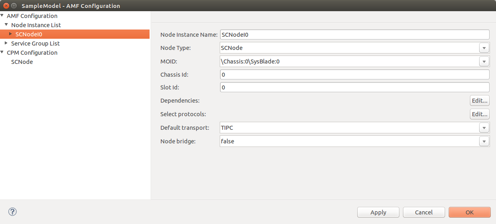

The information on this screen is described below:

* **Node Instance Name**: This field holds the name of the node instance. This name must be unique. The name that was generated combines the node type (SCNode), the letter 
  I (for Instance), and the number 0 (since this is the first instance of this type).

* **Node Type**: This field holds the node type that was selected on the wizard screen.

* **MOID**: This is the unique identifier for the node instance. It was generated by the wizard. The format of this ID is a string representing the one and only instance 
  of the chassis (\\Chassis:0) defined in the Resource Editor followed by a string representing the first and only instance of the blade type (\\SysBlade:0) that was 
  selected in the Node Instance Wizard.
  
  .. note::
    **MOID** is an acronym for Managed Object Identifier. It must be unique and is used to identify which hardware chassis and blade type this instance will run on.

Service Unit Instance
^^^^^^^^^^^^^^^^^^^^^
This screen displays the service unit instance that was created by the Service Group Instance Wizard. This service unit instance was created because the service unit 
type is associated with both the selected node type (SCNode) and the selected service group type (csa101SG) in our model.

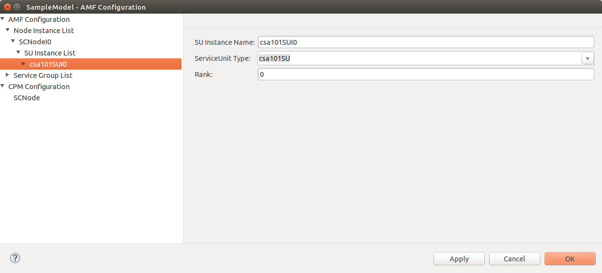

The information on this screen is described below.

* **SU Instance Name**: This field holds the name of the service unit instance. This name must be unique. The name that was generated combines the service unit type 
  (csa101SU), the letter I (for Instance), and the number 0 (since this is the first instance of this type).
* **Service Unit Type**: This field holds the type of the service unit instance.

Component Instance
^^^^^^^^^^^^^^^^^^
This screen displays the component instance that was created by the Service Group Instance Wizard. This component instance was created because the component type is 
associated with the created parent service unit type (csa101SU) in our model.

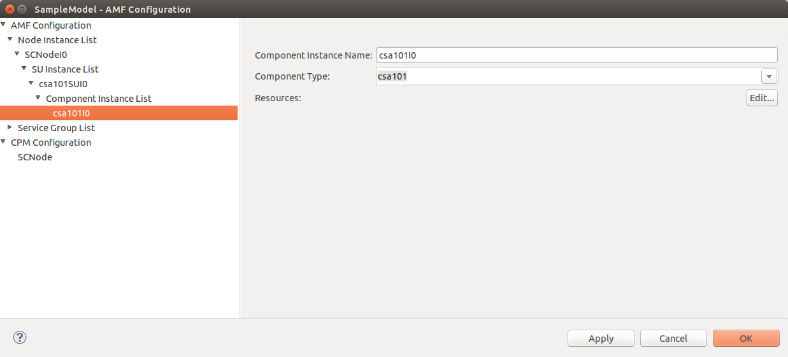

The information on this screen is described below.

* **Component Instance Name**: This field holds the name of the component instance. This name must be unique. The name that was generated combines the component type 
  (csa101), the letter I (for Instance), and the number 0 (since this is the first instance of this type).
* **Component Type**: This field holds the type of the component instance.

Service Group Instance
^^^^^^^^^^^^^^^^^^^^^^
This screen displays the service group instance that was created by the Service Group Instance Wizard. This service group instance was created because the service group 
type csa101SG was selected on the wizard screen.

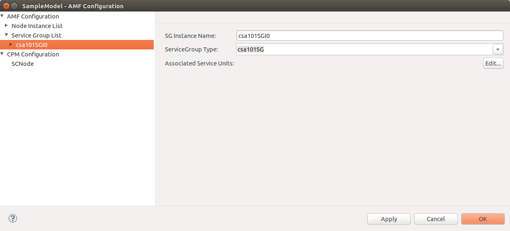

The information on this screen is described below.

* **SG Instance Name**: This field holds the name of the service group instance. This name must be unique. The name that was generated combines the service group type 
  (csa101SG), the letter I (for Instance), and the number 0 (since this is the first instance of this type).
* **ServiceGroup Type**: This field holds the type of the service group instance.
* **Associated Service Units**: This button is used to associate service unit instances with this service group instance. Creating this association indicates that the 
  selected service unit(s) will run within this service group instance.

Clicking the **Associated Service Units** Edit... button will display the following dialog.

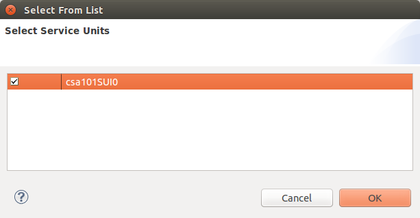

This dialog lists the service unit instances that can be associated with this service group instance. The list contains only one item, the service unit instance that 
was created by the wizard. This item is checked indicating that the wizard automatically chose this service unit instance to run within the service group instance.

Service Instance Instance
^^^^^^^^^^^^^^^^^^^^^^^^^
This screen displays the service instance that was created by the Service Group Instance Wizard. This service instance was created because the service instance type 
is associated with the parent service group type (csa101SG) in our model.

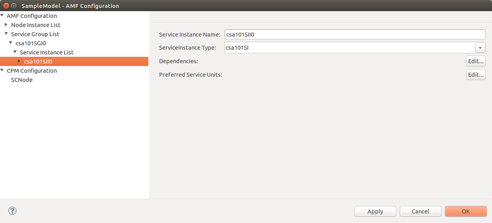

The information on this screen is described below.

* **Service Instance Name**: This field holds the name of the service instance. This name must be unique. The name that was generated combines the service instance type 
  (csa101SI), the letter I (for Instance), and the number 0 (since this is the first instance of this type).
* **ServiceInstance Type**: This field holds the type of the service instance.

Component Service Instance Instance
^^^^^^^^^^^^^^^^^^^^^^^^^^^^^^^^^^^
This screen displays the component service instance that was created by the Service Group Instance Wizard. This component service instance was created because the 
component service instance is associated with the parent service instance type (csa101SI) in our model.

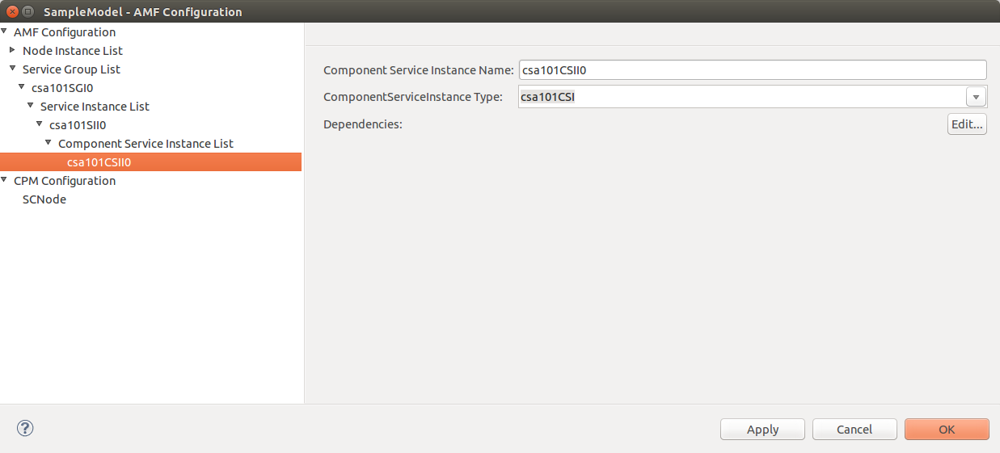

The information on this screen is described below.

* **Component Service Instance Name**: This field holds the name of the component service instance. This name must be unique. The name that was generated combines the 
  component service instance type (csa101CSI), the letter I (for Instance), and the number 0 (since this is the first instance of this type).
* **ComponentServiceInstance Type**: This field holds the type of the component service instance.

